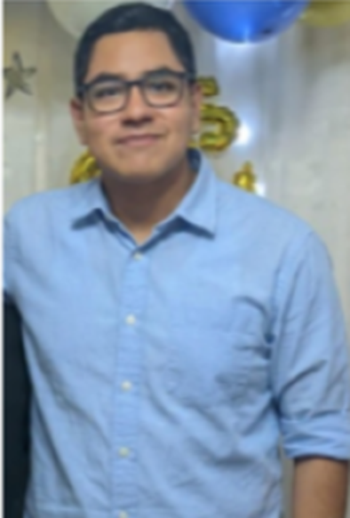
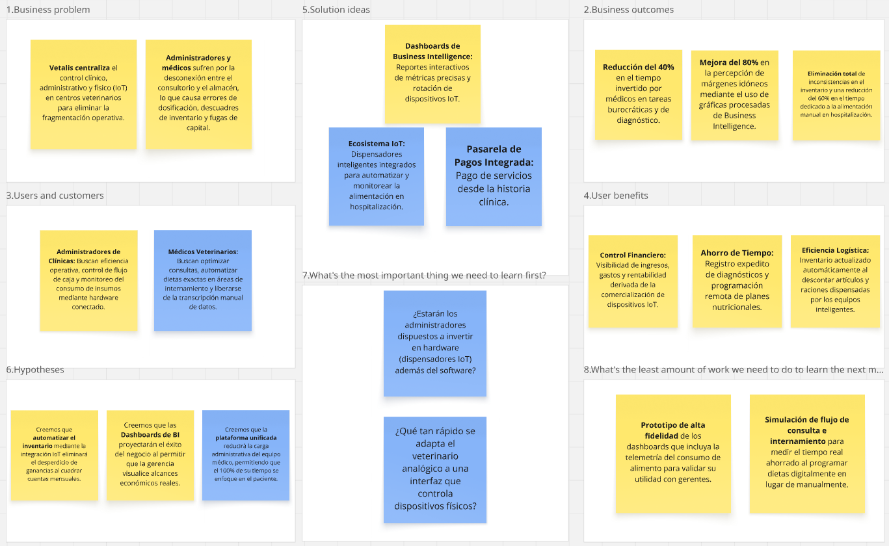

# Capítulo I: Startup & Solution Profile

***

## 1.1. Startup Profile

***

### 1.1.1. Descripción de la Startup

Animatik se fundamenta como una iniciativa tecnológica orientada a revolucionar el manejo administrativo, clínico y físico de las veterinarias. Vetalis, nuestro producto central, amalgama un software de gestión corporativa, una plataforma de historiales clínicos electrónicos y una infraestructura IoT.Este ecosistema permite a las clínicas centralizar tareas y multiplicar su rendimiento operativo. A través de este entorno, el doctor veterinario no solo controla insumos, agendas y fichas clínicas, sino que gestiona directamente los dispensadores inteligentes en el área de hospitalización; esto le permite configurar dietas automatizadas y precisas según los requerimientos de cada paciente. Por su parte, la gerencia accede a métricas en tiempo real, control de ingresos y rotación de dispositivos, asegurando una rentabilidad optimizada y un estándar de cuidado superior.

| Atributo | Declaración Estratégica |
| :--- | :--- |
| **Misión** | Proveer a los centros veterinarios de una solución unificada que abarque flujos clínicos, contables y automatización física (IoT), facilitando la sanación animal y asegurando el éxito comercial. |
| **Visión** | Ser el ecosistema digital y de hardware líder en la región para el rubro veterinario, impulsando la modernización hacia organizaciones altamente eficientes, interconectadas y de gran valor médico. |

#### Valor Agregado de la Plataforma:
* **Manejo Operativo y Médico:** Registro expedito de mascotas, diagnósticos y recetarios desde la misma consulta.
* **Automatización Física (IoT):** Integración con dispensadores automáticos de comida para programar dietas exactas en hospitalización y monitorear el consumo nutricional de forma remota.
* **Inventario Automatizado:** Descuento en tiempo real de artículos, medicinas y raciones de alimento dispensadas.
* **Finanzas Transparentes:** Análisis de ingresos y salidas a través de gráficos interactivos.
* **Pagos Integrados:** Cobro directo en plataforma, incluyendo la comercialización y suscripción de los dispositivos IoT para clientes finales.

### 1.1.2. Perfiles de integrantes del equipo

| Nombres y Apellidos | Gamero Miranda, Lui Mathias - U202419335 |
|:--------------------| :--- |
| **Descripción**     | Experto en aseguramiento de calidad, pruebas corporativas y entrega del aplicativo. Vela por el estricto cumplimiento de los estándares de programación en todos los módulos de Vetalis. |
| **Foto**            |  |

 

| Nombre y Apellido | Roman Zevallos, Sebastian Jared - U202419009 |
| :--- | :--- |
| **Descripción** | Especialista en bases de datos. Se encarga de diseñar la persistencia de los registros médicos y financieros dentro de Animatik, asegurando integridad, rendimiento y disponibilidad del sistema. |
| **Foto** |  |

 

| Nombre y Apellido | Romero Vilela, Dario Alberto - U202419286 |
| :--- | :--- |
| **Descripción** | Estudiante de Ingeniería de Software, destacando fuertemente en el trabajo en equipo, la programación en C++ y el autoaprendizaje continuo para la mejora del código interno. |
| **Foto** |  |

 

| Nombre y Apellido | Sanchez Benavente, Leonardo Matias - U20241B184 |
| :--- | :--- |
| **Descripción** | Desarrollador Front-End. Encargado de trasladar los prototipos a pantallas funcionales y reactivas dentro de Vetalis, logrando una experiencia rápida y sin interrupciones para los clientes finales. |
| **Foto** |  |

 

| Nombre y Apellido | Sejuro Medina, Mario Gabriel - U20241C198 |
| :--- | :--- |
| **Descripción** | Especialista UI/UX de Animatik. Su principal objetivo es crear flujos visuales armónicos y sencillos, priorizando que Vetalis responda de manera predictiva e intuitiva a las necesidades del profesional. |
| **Foto** |  |

## 1.2. Solution Profile

***

**Animatik** es una iniciativa tecnológica orientada a revolucionar el manejo administrativo, clínico y físico de los centros veterinarios a través de su producto central: **Vetalis**. Nuestra solución es un ecosistema integral que amalgama un software de gestión empresarial (ERP), una plataforma de historiales clínicos electrónicos (EHR) y una **infraestructura IoT** de dispensación inteligente.

A diferencia de los sistemas tradicionales, Vetalis permite que el médico veterinario configure y automatice la nutrición en áreas de hospitalización según las necesidades específicas de cada paciente, sincronizando este consumo con el inventario y la facturación en tiempo real. Al proporcionar dashboards de inteligencia de negocios y automatización física, Animatik permite que la gerencia maximice la rentabilidad mientras el personal médico optimiza su tiempo y la precisión del tratamiento.

---

### 1.2.1. Antecedentes y Problemática

En el sector veterinario actual, la fragmentación operativa no solo afecta la administración, sino que se extiende al cuidado físico del paciente. La desconexión entre el área médica, el almacén y las zonas de hospitalización genera errores en la dosificación de alimentos, descuadres críticos de inventario y una sobrecarga en el personal técnico. Según Beyer, Chomiak-Orsa, Pietrzykowski y Rozkrut (2025), la transformación digital es un imperativo para superar estas ineficiencias; sin embargo, en veterinaria, esta transformación queda incompleta si no integra el manejo físico del paciente (IoT) con el registro clínico.

Al analizar esta situación con la metodología de las **5 W’s y 2 H’s** se identifican los siguientes elementos:

* **Who (Quiénes):** Administradores que pierden el rastro de insumos y rentabilidad; médicos veterinarios que enfrentan una alta carga de transcripción de datos; y personal técnico sobrecargado por tareas manuales de alimentación y pesaje de raciones.
* **What (Qué):** La problemática radica en la **fragmentación entre el software de gestión y el cuidado físico**. Las clínicas carecen de una plataforma que conecte el diagnóstico médico con la ejecución física de dietas y el control de stock derivado de estas.
* **When (Cuándo):** El desafío es crítico durante la hospitalización, donde la falta de sistemas que sincronicen la dispensación de alimento con el registro financiero y clínico genera fugas de capital e inconsistencias en el tratamiento.
* **Where (Dónde):** En el "back-office" contable y en las **áreas de internamiento y hospitalización**. El problema se localiza donde el error humano en procesos manuales de cuidado físico impide una toma de decisiones estratégica (Soltani & Siadati, 2019).
* **Why (Por qué):** Las causas principales son el uso de herramientas aisladas que no se comunican con el hardware de la clínica y la dependencia de procesos manuales para la dosificación nutricional, lo que obstaculiza la mejora de procesos (Beyer et al., 2025).
* **How (Cómo):** Se manifiesta en una administración reactiva, desabastecimiento de insumos médicos y errores de dosificación nutricional que comprometen la recuperación del paciente.
* **How Much (Cuánto):**
    * La digitalización e integración IoT permite agilizar los procesos de diagnóstico y cuidado en un **40%** (Beyer et al., 2025).
    * La automatización de tareas nutricionales reduce el tiempo operativo manual en hospitalización hasta en un **60%**.
    * La implementación de BI y hardware conectado incrementa la eficiencia operativa y la retención de capital al evitar fugas de inventario (Soltani & Siadati, 2019).

---

### 1.2.2. Lean UX Process

#### 1.2.2.1. Lean UX Problem Statements

**Problem Statement 1: Enfoque en la Gestión Logística y Financiera IoT**
Nuestra solución, Vetalis, ofrece una plataforma de gestión (ERP) que sincroniza el control contable con la infraestructura física de la clínica. A través del ecosistema, los administradores aceden a dashboards de BI que integran la rotación de dispositivos IoT y el consumo exacto de insumos.

Se ha identificado que el aislamiento del balance contable respecto al consumo real en áreas de internamiento provoca fugas de capital y quiebres de stock no detectados.

Por tanto, nos preguntamos: **¿Cómo podríamos proporcionar a los administradores una plataforma unificada que sincronice automáticamente el uso de productos médicos y alimento (vía IoT) con la contabilidad en tiempo real, eliminando desajustes de inventario y facilitando el control total del flujo de caja?**

**Problem Statement 2: Enfoque en la Sinergia Clínica y Automatización del Cuidado (EHR + IoT)**
Nuestra solución ofrece un ecosistema clínico donde el médico veterinario no solo gestiona historiales, sino que configura directamente los dispensadores IoT según el cuadro clínico del paciente hospitalizado.

Se ha identificado que el personal médico sufre una doble carga: burocrática (transcripción manual de datos) y operativa (dosificación manual de dietas). Esta desconexión consume tiempo vital y aumenta el riesgo de errores en tratamientos nutricionales.

Por tanto, nos preguntamos: **¿Cómo podríamos ofrecer a los médicos veterinarios una herramienta que unifique el registro clínico con la ejecución automatizada de dietas vía IoT, eliminando tareas repetitivas y permitiéndoles enfocar el 100% de su tiempo en la recuperación del paciente?**

#### 1.2.2.2. Lean UX Assumptions

* **Creo que mis clientes necesitan:** centralizar su operativa clínica, financiera y el cuidado físico en hospitalización en un solo entorno digital, ya que la desconexión actual genera errores de tratamiento y fugas de capital.
* **Estas necesidades se pueden resolver mediante:** nuestra plataforma Vetalis, que vincula expedientes médicos con dispensadores inteligentes IoT, automatizando la salida de almacén según la receta configurada por el doctor.
* **Mis clientes iniciales serán:** administradores y médicos de clínicas veterinarias urbanas con alta rotación de pacientes hospitalizados que requieren modernizar su gestión operativa.
* **El valor #1 que un cliente quiere de nuestro servicio es:** la eliminación de la duplicidad de tareas administrativas y la ejecución manual de tareas nutricionales, obteniendo un control exacto del stock.
* **El cliente también puede obtener estos beneficios adicionales mediante:** telemetría de consumo de alimento en tiempo real, programación ágil de citas y pasarelas de pago integradas que mejoran la experiencia del dueño de la mascota.
* **Voy a adquirir la mayoría de mis clientes a través de:** estrategias de venta B2B directa que incluyan el software y el comodato o venta de hardware inteligente, además de demostraciones enfocadas en el ROI operativo.
* **Haré dinero a través de:** un modelo de suscripción (SaaS) escalonado y rentas o ventas derivadas de la comercialización de la infraestructura IoT (dispensadores).
* **Mi competencia principal serán:** softwares de gestión veterinaria genéricos que funcionan solo como agendas estáticas y sistemas de contabilidad manuales que no integran el componente físico (hardware).
* **Los venceremos debido a:** nuestra capacidad de conectar directamente la acción médica y la nutrición automatizada (EHR-IoT) con el impacto financiero inmediato (ERP) en una interfaz intuitiva.
* **Mi mayor riesgo de producto es:** la resistencia al cambio por parte de personal acostumbrado a procesos analógicos. Lo resolveremos con una experiencia de usuario (UX) minimalista y un despliegue de hardware *plug-and-play*.

#### 1.2.2.3. Lean UX Hypothesis Statements

* **Hipótesis 1 (Eficiencia Logística y Financiera):** Creemos que automatizar el control de inventario vinculando los dispensadores IoT al registro médico del historial clínico eliminará las fugas de capital. **Sabremos que estamos bien cuando** las clínicas que implementen Vetalis reporten una reducción significativa en discrepancias de stock a fin de mes.
* **Hipótesis 2 (Estrategia de Datos y BI):** Creemos que proporcionar a los administradores dashboards de inteligencia de negocios con datos de consumo IoT e ingresos mejorará sustancialmente la toma de decisiones. **Sabremos que estamos bien cuando** los centros logren incrementar su percepción de salud financiera y rentabilidad en hasta un 80%.
* **Hipótesis 3 (Rendimiento Clínico-Operativo):** Creemos que integrar el historial médico con la dosificación automatizada IoT reducirá la fragmentación operativa del personal. **Sabremos que estamos bien cuando** las métricas demuestren una reducción del 40% en carga administrativa y del 60% en el tiempo dedicado a tareas de alimentación manual.
#### 1.2.2.4. Lean UX Canvas

## 1.3. Segmentos objetivo

La tendencia en el bienestar de las mascotas no para de crecer poblacionalmente hablando (CPI, 2023). En contrapartida, organismos promotores del comercio de la ciudad previenen que, aun habiendo un número sin precedentes de centros curativos, una gigantesca ración perece frente al descontrol contable y falta imperativa de innovación modernizadora, tanto en gestión de datos como en automatización física. Impulsados bajo esta luz, focalizamos a Animatik a través de dos blancos principales:

* **Médicos veterinarios en clínicas de mediano a alto flujo** que carecen de herramientas integradas. La gestión manual de historiales e inventarios consume un tiempo crítico. Ante la alta demanda, requieren una plataforma clínica en tiempo real para optimizar consultas, controlar medicamentos y programar la alimentación exacta de pacientes internados usando dispensadores inteligentes, mejorando la atención al paciente y reduciendo su dependencia de procesos analógicos.

* **Administradores de centros veterinarios**, usualmente entre 30 y 55 años, enfocados en la eficiencia operativa y financiera. La plataforma les brindará herramientas de inteligencia de negocios, control de flujo de caja, pagos integrados y el monitoreo automático del consumo de alimento a través de los equipos conectados. Esto les dará reportes claros, facilitando decisiones para maximizar la rentabilidad y evitar el desperdicio de insumos.
