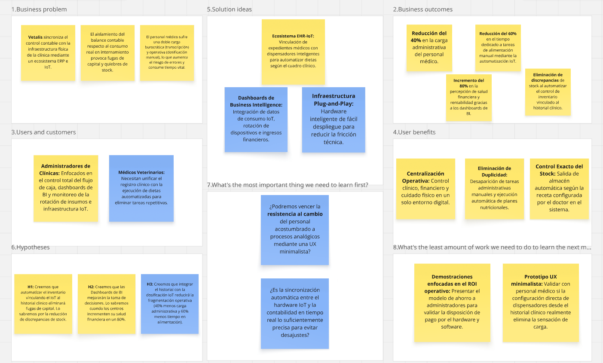

# Capítulo I: Startup & Solution Profile

***

## 1.1. Startup Profile

***

### 1.1.1. Descripción de la Startup

**Animatik** se fundamenta como una iniciativa tecnológica orientada a revolucionar el manejo administrativo y financiero de las veterinarias. **Vetalis**, nuestro producto central, amalgama un software de gestión corporativa (ERP) con una plataforma de historiales clínicos electrónicos (EHR). Este desarrollo permite a las clínicas actuales centralizar sus tareas y multiplicar su rendimiento diario. Gracias a esto, los **doctores veterinarios** controlan los insumos, consultan agendas y actualizan fichas de pacientes al instante. A la par, la **gerencia** accede a métricas de negocio precisas, control de ingresos y puntos de pago integrados, lo que propicia una mayor rentabilidad general.

| Atributo | Declaración Estratégica |
| :--- | :--- |
| **Misión** | Proveer a los centros veterinarios de una solución unificada que abarque los flujos clínicos, contables y de reservas, facilitando que los expertos se centren en sanar a los animales y asegurando a la vez el éxito comercial del negocio. |
| **Visión** | Ser el ecosistema digital líder en la región para el rubro veterinario, impulsando la modernización de los consultorios tradicionales hacia organizaciones altamente eficientes y de gran valor médico. |

#### Valor Agregado de la Plataforma:
* **Manejo Operativo y Médico:** Registro expedito de mascotas, diagnósticos y recetarios desde la misma consulta.
* **Inventario Automatizado:** Descuento en tiempo real de los artículos y medicinas usados al término de cada revisión.
* **Finanzas Transparentes:** Análisis de ingresos y salidas de dinero a través de gráficos interactivos, favoreciendo la planificación estratégica.
* **Pagos Integrados:** Posibilidad de cobrar y facturar directamente en la plataforma, simplificando la contabilidad diaria.

### 1.1.2. Perfiles de integrantes del equipo

| Nombre y Apellido | Gamero Miranda, Lui Mathias - U202419335 |
| :--- | :--- |
| **Descripción** | Experto en aseguramiento de calidad, pruebas corporativas y entrega del aplicativo. Vela por el estricto cumplimiento de los estándares de programación en todos los módulos de Vetalis. |
| **Foto** |  |

 

| Nombre y Apellido | Roman Zevallos, Sebastian Jared - U202419009 |
| :--- | :--- |
| **Descripción** | Especialista en bases de datos. Se encarga de diseñar la persistencia de los registros médicos y financieros dentro de Animatik, asegurando integridad, rendimiento y disponibilidad del sistema. |
| **Foto** |  |

 

| Nombre y Apellido | Romero Vilela, Dario Alberto - U202419286 |
| :--- | :--- |
| **Descripción** | Estudiante de Ingeniería de Software, destacando fuertemente en el trabajo en equipo, la programación en C++ y el autoaprendizaje continuo para la mejora del código interno. |
| **Foto** |  |

 

| Nombre y Apellido | Sanchez Benavente, Leonardo Matias - U20241B184 |
| :--- | :--- |
| **Descripción** | Desarrollador Front-End. Encargado de trasladar los prototipos a pantallas funcionales y reactivas dentro de Vetalis, logrando una experiencia rápida y sin interrupciones para los clientes finales. |
| **Foto** |  |

 

| Nombre y Apellido | Sejuro Medina, Mario Gabriel - U20241C198 |
| :--- | :--- |
| **Descripción** | Especialista UI/UX de Animatik. Su principal objetivo es crear flujos visuales armónicos y sencillos, priorizando que Vetalis responda de manera predictiva e intuitiva a las necesidades del profesional. |
| **Foto** |  |

## 1.2. Solution Profile

***

**Vetalis** actúa como un software todo-en-uno que fusiona las áreas empresariales (ERP) y de salud clínica (EHR) con el fin de unificar operaciones en las clínicas veterinarias. Su objetivo supremo es acabar con la descentralización de la información, enlazando en un único panel la atención de las mascotas, los calendarios de reservas, la rebaja automática de utilería y el seguimiento financiero riguroso. Equipado con indicadores interactivos y puntos de facturación fluidos, Vetalis alienta estrategias comerciales sólidas y ahorra a los médicos valiosas horas de tipeo rutinario.

### 1.2.1. Antecedentes y problemática

Actualmente, la mayor parte de las instalaciones veterinarias emplea herramientas fragmentadas (o directamente registros a papel) que restan demasiada agilidad. Dicha divergencia entre el consultorio médico y el área organizativa resulta en descuadres de dinero, robos o pérdidas de insumos y profunda desinformación ejecutiva. Múltiples investigaciones apuntan a que la modernización tecnológica es innegociable para dejar atrás estas fallas operacionales y elevar la competitividad de las veterinarias.

Al aplicar el modelo de las **5 W's y 2 H's**, observamos:

* **Who (Quiénes):** Impacta sobre todo a dueños y gerentes que demandan control contable fidedigno, así como a doctores que requieren una herramienta interactiva rápida para su rutina clínica.
* **What (Qué):** El núcleo del problema radica en la desconexión del software. Faltan programas que interconecten el consumo de productos médicos dentro de los consultorios con el almacén principal y la caja.
* **When (Cuándo):** Ocurre a toda hora, repercutiendo desde la agenda del cliente hasta la liquidación del pago. Principalmente al evidenciarse que los materiales gastados no se reportan en la contabilidad general de forma automática.
* **Where (Dónde):** Reside en las oficinas logísticas (back-office) de veterinarias urbanas. Al operar con visibilidad nula (sin Inteligencia de Negocios o BI), la clínica trabaja de manera reactiva en lugar de proactiva.
* **Why (Por qué):** Debido a la barrera entre plataformas ofimáticas y registros médicos básicos. La ausencia de un formato integral detona conteos en hojas de cálculo imprecisas.
* **How (Cómo):** Desencadena operaciones trabadas, filas de espera en caja y desabastecimiento repentino. Avanzar a un plano digital erradica los bloqueos estimulando el flujo del dinero líquido.
* **How Much (Cuánto):** Contar con un despliegue tecnológico no solo remedia los cortes organizacionales, sino que agiliza el diagnóstico por encima del 40% del tiempo de consultas y afianza cuantiosas sumas de retención de capital.

### 1.2.2. Lean UX Process

#### 1.2.2.1. Lean UX Problem Statements

**Problem Statement 1: Monitorización Logística y Financiera**
Vetalis está pensado para consolidar los espectros contables y logísticos desde su matriz empresarial (ERP). Gracias a ello, la cúpula de la veterinaria obtiene reportería clara, portales de pago y automatización de repuestos. Ciertas evaluaciones evidencian que el aislamiento del balance contable promueve escenarios sin insumos disponibles y parálisis estratégica. Partiendo de este contexto, ideamos lo siguiente: **¿De qué forma construimos una herramienta integral que sincronice el consumo de productos médicos y la economía a gran escala, eliminando los desajustes y entregando transparencia en las finanzas de la empresa?**

**Problem Statement 2: Maximizando la Efectividad Clínica**
Internamente, nuestro apartado EHR dota al experto veterinario con una interfaz fácil para redactar síntomas, preinscribir recetas o acomodar turnos. En la actualidad, estos especialistas derrochan casi la mitad de su consulta copiando de nuevo la misma información para entregársela al gerente u oficinista. Entonces, nos preguntamos lo próximo: **¿Cómo liberamos al médico veterinario de esta pesada sobrecarga burocrática mediante un servicio que deseche las validaciones inútiles, encausando su tiempo íntegro hacia el beneficio animal?**

#### 1.2.2.2. Lean UX Assumptions

* **Creemos sinceramente que nuestros usuarios meta necesitan** alinear su labor clínica y de ventas dentro de un único recurso digital, para fulminar el tiempo muerto y contrarrestar des balances de recursos críticos.
* **Las exigencias anteriores se atenuarán usando** Vetalis, logrando atar directamente los expedientes con las salidas de almacenes, a la par que arroja un análisis fiscal constante.
* **Nuestro pionero de adopción temprana contempla a** dueños administrativos y doctores en áreas sumamente pobladas, quienes se ven acorralados por la multitud que atienden a diario.
* **El mayor triunfo de valor brindado es** anular por completo la doble mecanografía de información (registros internos y caja), asegurando minutos preciosos en el consultorio.
* **Dentro de las bondades periféricas, se incluyen** rastreos minuciosos del dinero, una cuadrícula flexible para planificar encuentros con pacientes y transacciones remotas fluidas.
* **Lograremos posicionamiento en la industria apoyándonos en** esquemas promocionales B2B, asistencia a ferias de mascotas corporativas y periodos de gracia (Trial) para atestiguar el impacto del software en vivo.
* **La facturación como empresa (Animatik) recae sobre** planes tipo Software as a Service (SaaS) adaptables por aforos, y rentas comisionistas derivados de transacciones pagadas vía Vetalis.
* **Nuestras amenazas en el plano de ventas refieren a** programas locales anticuados o sistemas que priorizan solo agendar, sin llegar nunca al nivel comercial (ERP).
* **Nuestra lanza principal comprende** enlazar el estado natural de la salud (EHR) con estrategias profundas de capital y rendimiento en una sola experiencia fluida (UX).
* **El factor adverso más alarmante es** el recelo del veterinario analógico ante lo digital. Diluiremos esta fricción de curva tecnológica por medio de interfaces minimalistas y un seguimiento amigable tras la compra.

#### 1.2.2.3. Lean UX Hypothesis Statements

* **Declaración 1 (Flujos Económicos Constantes):** Prevemos que concatenar el surtido interior al registro del médico desaparecerá el desperdicio de ganancias por equivocación humana. Sabremos que esto es absoluto cuando merme notablemente el pánico e inconsistencias a fin de cada mes al cuadrar cuentas.
* **Declaración 2 (Apalancamiento de Datos y BI):** Asumimos férreamente que obsequiarle a la gerencia gráficas procesadas sobre sus alcances económicos, proyectará el éxito del emprendimiento. Tendremos constancia al percatar subidas superiores al 80% en la apreciación de márgenes idóneos medidos en encuestas.
* **Declaración 3 (Rendimiento por Paciente):** Confirmamos que consolidar liquidaciones, tratamientos y fichas enlazadas liberará los frenos de eficiencia para el veterinario principal. El acierto vendrá cuando las métricas logren documentar ahorros de reloj de hasta cuarenta por ciento en actividades burocráticas dentro de su día.

#### 1.2.2.4. Lean UX Canvas

## 1.3. Segmentos objetivo

***

La tendencia en el bienestar de las mascotas no para de crecer poblacionalmente hablando (CPI, 2023). En contrapartida, organismos promotores del comercio de la ciudad previenen que, aun habiendo un número sin precedentes de centros curativos, una gigantesca ración perece frente al descontrol contable y falta imperativa de innovación modernizadora. Impulsados bajo esta luz, focalizamos a Animatik a través de dos blancos principales:

* **Médicos en Tráfico Constante:** Quienes ocupan gigantescas franjas de sus horas ordenando datos de las consultas de hoy a papel. Anhelan un apoyo sistemático que fluya automáticamente y no los margine del contexto administrativo de la firma completa.

* **Dirección Corporativa de Veterinarias:** Perfiles de 30 a 55 años inmersos en evitar desbalances y en promover el crecimiento constante. Empoderados con Vetalis en su modalidad gerencial, portarán gráficas intachables del volumen operario de su grupo con el fin de jamás sucumbir al derroche ni a las quiebras por extravíos de fármacos.

Delimitarnos en estas vertientes promete un afianzamiento expedito para el progreso de la marca, asegurando a posteriori el paso evolutivo a todos los eslabones regionales dedicados al mundo y protección de animales de compañía en América Latina.
