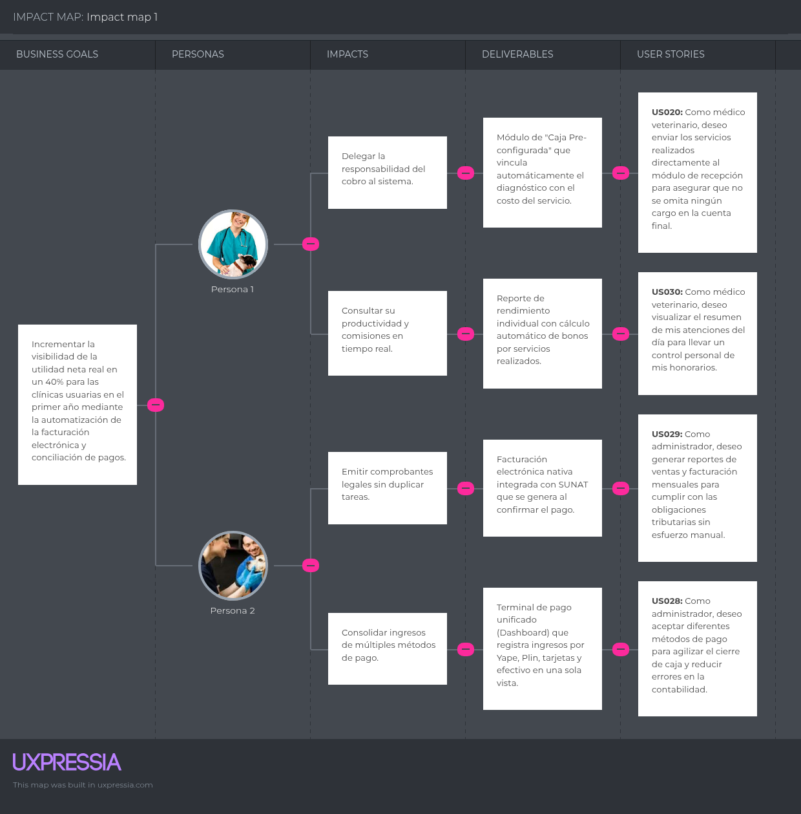
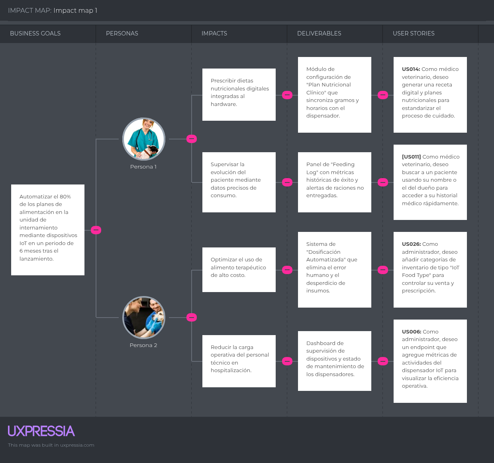
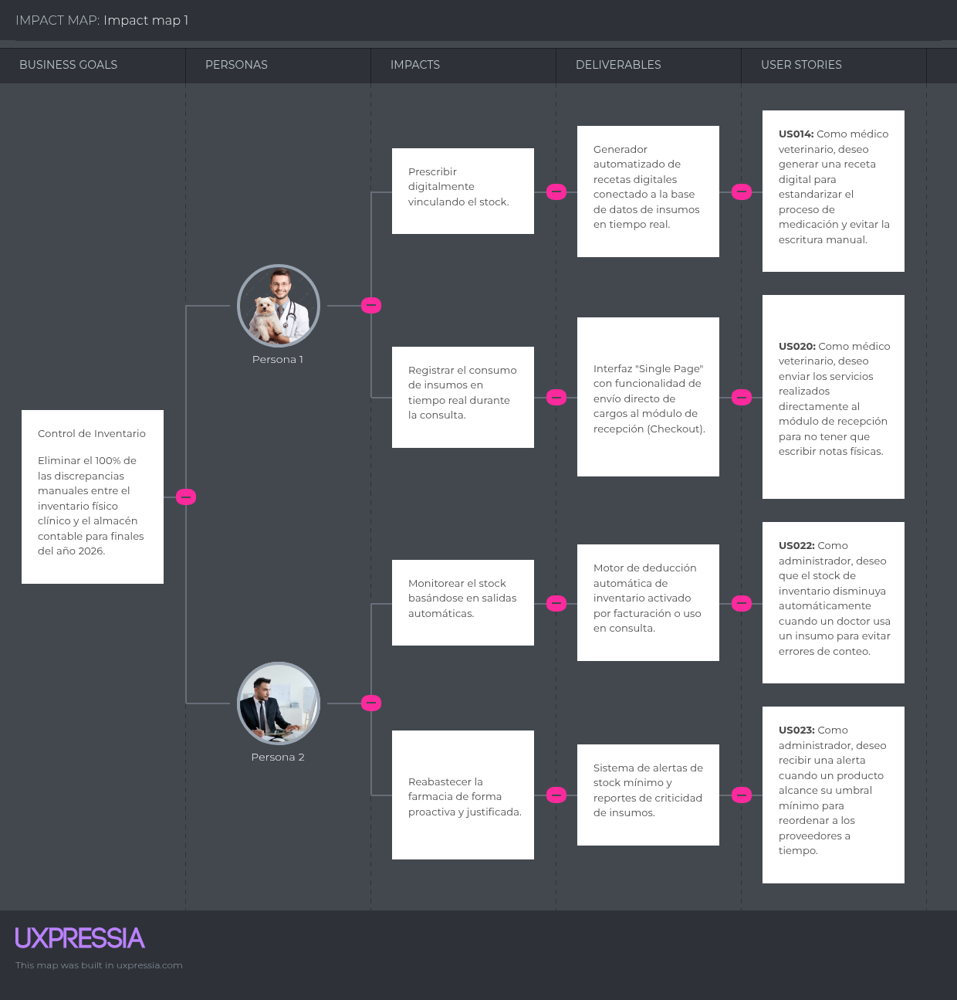

# Capítulo III: Requirements Specification

---

## 3.1. User Stories

### Epic 1: Landing Page (Static Web Site)

**US001: View Value Proposition**
**As a** visitor,
**I want to** read the main value proposition of VET-Smart on the home page,
**so that** I can understand the comprehensive care features the software offers.

#### Acceptance Criteria
- **Scenario 1: Successfully display the main value proposition**
    - **Given** a visitor accesses the main URL of the VET-Smart landing page,
    - **When** the home page loads completely in the web browser,
    - **Then** the system displays the main value proposition text, the IoT feeding automation summary, and the primary call-to-action buttons.
- **Scenario 2: Slow connection fallback**
    - **Given** a visitor with a slow internet connection accesses the page,
    - **When** the text assets are prioritized over high-resolution images,
    - **Then** the system displays the value proposition text immediately while the background images finish loading.

---

**US002: Select Veterinarian Segment**
**As a** visitor of the veterinarian segment,
**I want to** access a specific section detailing clinical features,
**so that** I can evaluate specialized care tools relevant to my daily practice.

#### Acceptance Criteria
- **Scenario 1: Successfully navigate to the veterinarian features section**
    - **Given** the visitor is navigating the main navigation menu,
    - **When** the visitor clicks on the "For Veterinarians" link,
    - **Then** the system redirects the visitor to a dedicated section detailing the EHR, prescription features, and nutritional control via IoT dispenser.
- **Scenario 2: Direct access via URL**
    - **Given** a visitor enters the specific veterinarians features URL directly in the browser,
    - **When** the server processes the request,
    - **Then** the system loads the specific clinical segment page directly without going through the home page.

---

**US003: Request Software Demo**
**As a** visitor of the administrator segment,
**I want to** submit a contact form to request a software demo,
**so that** I can see how it helps manage my clinic operations.

#### Acceptance Criteria
- **Scenario 1: Successfully submit a demo request form**
    - **Given** the visitor has filled out the demo request form with valid contact information,
    - **When** the visitor clicks the "Submit Request" button,
    - **Then** the system registers the lead in the database and displays a success confirmation message.
- **Scenario 2: Submit form with missing required fields**
    - **Given** the visitor leaves the "Email" or "Clinic Name" fields empty,
    - **When** the visitor clicks the "Submit Request" button,
    - **Then** the system prevents submission and highlights the missing fields with an error message.

---

**US004: View Pricing Plans**
**As a** visitor,
**I want to** view the available subscription plans,
**so that** I can evaluate the financial cost of the software.

#### Acceptance Criteria
- **Scenario 1: Successfully display pricing tiers**
    - **Given** the visitor is on the pricing page,
    - **When** the page renders,
    - **Then** the system displays a comparative table with the features and monthly costs of the Basic, Pro, and Enterprise plans.
- **Scenario 2: Toggle between monthly and annual billing**
    - **Given** the visitor is viewing the pricing table,
    - **When** the visitor toggles the "Annual Billing" switch,
    - **Then** the system updates the displayed prices to show the discounted annual rates.

---

**US005: Access FAQ Section**
**As a** visitor,
**I want to** read frequently asked questions,
**so that** I can resolve my basic doubts without contacting support.

#### Acceptance Criteria
- **Scenario 1: Successfully expand an FAQ item**
    - **Given** the visitor is in the FAQ section of the landing page,
    - **When** the visitor clicks on a specific question,
    - **Then** the system expands the container to reveal the corresponding text answer.
- **Scenario 2: Collapse an expanded FAQ item**
    - **Given** an FAQ item is currently expanded and showing its answer,
    - **When** the visitor clicks on the same question again,
    - **Then** the system collapses the answer container to its original state.

---

**US006: Read Client Testimonials**
**As a** visitor,
**I want to** read testimonials from current clinics using VET-Smart,
**so that** I can build trust in the product.

#### Acceptance Criteria
- **Scenario 1: Successfully render the testimonials carousel**
    - **Given** the visitor scrolls down to the social proof section,
    - **When** the section becomes visible in the viewport,
    - **Then** the system displays a carousel of verified reviews from clinic administrators and veterinarians.
- **Scenario 2: Manual navigation of testimonials**
    - **Given** the testimonials carousel is visible,
    - **When** the visitor clicks the "Next" or "Previous" arrow buttons,
    - **Then** the system slides the carousel to show the corresponding review card.

---

**US007: Subscribe to Newsletter**
**As a** visitor,
**I want to** subscribe to the newsletter,
**so that** I can receive updates on new features and tips.

#### Acceptance Criteria
- **Scenario 1: Successfully register an email for the newsletter**
    - **Given** the visitor enters a valid email address in the subscription footer,
    - **When** the visitor clicks the "Subscribe" button,
    - **Then** the system adds the email to the mailing list and shows a "Thank you" toast notification.
- **Scenario 2: Register with an invalid email format**
    - **Given** the visitor enters text that does not follow the "user@domain.com" format,
    - **When** the visitor clicks the "Subscribe" button,
    - **Then** the system displays an "Invalid email address" validation error.

---

**US008: View Mobile Menu**
**As a** visitor using a smartphone,
**I want to** use a responsive hamburger menu,
**so that** I can navigate the site easily on a small screen.

#### Acceptance Criteria
- **Scenario 1: Successfully open the mobile navigation menu**
    - **Given** the visitor is viewing the landing page on a device with screen width under 768px,
    - **When** the visitor taps the hamburger menu icon,
    - **Then** the system opens a slide-out menu containing all navigation links.
- **Scenario 2: Close the mobile menu**
    - **Given** the mobile navigation menu is currently open,
    - **When** the visitor taps the "X" icon or clicks outside the menu area,
    - **Then** the system closes the slide-out menu.

---

**US009: Access Contact Information**
**As a** visitor,
**I want to** find the company's contact email and phone number easily,
**so that** I can reach out for direct inquiries.

#### Acceptance Criteria
- **Scenario 1: Successfully locate the contact details**
    - **Given** the visitor navigates to the Footer section,
    - **When** the visitor looks at the "Contact Us" column,
    - **Then** the system displays the official support email, phone number, and physical address.
- **Scenario 2: Clickable contact links**
    - **Given** the contact information is visible in the footer,
    - **When** the visitor clicks on the displayed email address,
    - **Then** the system opens the user's default email client with a new draft addressed to the support team.

---

**US010: View Privacy Policy**
**As a** visitor,
**I want to** access the Privacy Policy page,
**so that** I can understand how my data and my clinic's data will be handled.

#### Acceptance Criteria
- **Scenario 1: Successfully load the legal documents page**
    - **Given** the visitor is on the landing page,
    - **When** the visitor clicks the "Privacy Policy" link in the footer,
    - **Then** the system redirects to a static page containing the full text of the privacy policy.
- **Scenario 2: Navigation back from Privacy Policy**
    - **Given** the visitor is reading the Privacy Policy page,
    - **When** the visitor clicks the browser's "Back" button or a "Return to Home" link,
    - **Then** the system redirects the visitor back to the previous section of the landing page.

---

### Epic 2: Clinical Management - EHR (Veterinarian)

**US011: Search Patient Profile**
**As a** veterinarian,
**I want to** search for a patient using their name or owner's name,
**so that** I can access their medical record quickly.

#### Acceptance Criteria
- **Scenario 1: Successfully retrieve a patient profile**
    - **Given** a patient named "Bobby" belonging to owner "Juan Perez" exists in the database,
    - **When** the veterinarian types "Bobby" into the patient search bar,
    - **Then** the system retrieves and displays Bobby's profile in the search results list.
- **Scenario 2: No search results found**
    - **Given** a veterinarian searches for a name that does not exist in the database,
    - **When** the search is executed,
    - **Then** the system displays a "No patients found matching your search" message.

---

**US012: Record Vital Signs**
**As a** veterinarian,
**I want to** register the weight and temperature during triage,
**so that** I can evaluate the patient's initial condition.

#### Acceptance Criteria
- **Scenario 1: Successfully save triage vital signs**
    - **Given** an active medical consultation for a patient,
    - **When** the veterinarian enters numeric values for weight and temperature and clicks save,
    - **Then** the system records the vital signs with the current date and time in the clinical history.
- **Scenario 2: Invalid input for vital signs**
    - **Given** the veterinarian enters non-numeric text into the "Temperature" field,
    - **When** the veterinarian attempts to save the record,
    - **Then** the system displays a validation error and prevents the record from being stored.

---

**US013: View Allergy Alerts**
**As a** veterinarian,
**I want to** see a visual alert if the patient has allergies,
**so that** I avoid prescribing harmful medication.

#### Acceptance Criteria
- **Scenario 1: Successfully display a critical allergy alert**
    - **Given** a patient has an active penicillin allergy registered in their profile,
    - **When** the veterinarian opens the patient's clinical history view,
    - **Then** the system displays a red, high-priority alert banner at the top of the screen.
- **Scenario 2: Patient with no registered allergies**
    - **Given** a patient with no known allergies recorded in the database,
    - **When** the veterinarian opens the patient's profile,
    - **Then** the system displays a "No known allergies" label in the medical summary section.

---

**US014: Create Digital Prescription**
**As a** veterinarian,
**I want to** generate a digital prescription and nutritional plans,
**so that** I can standardize the medication and care process.

#### Acceptance Criteria
- **Scenario 1: Successfully generate a clinical prescription**
    - **Given** the veterinarian is in the prescription module of an active consultation,
    - **When** the veterinarian selects a medication or therapeutic diet, inputs the dosage, and clicks generate,
    - **Then** the system creates a structured digital prescription linked to the consultation ID.
- **Scenario 2: Save prescription as draft**
    - **Given** a veterinarian has started filling out a prescription but has not finished,
    - **When** the veterinarian clicks "Save as Draft",
    - **Then** the system stores the progress without generating a final prescription ID.

---

**US015: Lock Clinical Record**
**As a** veterinarian,
**I want to** lock the editing of a record once the consultation is finished,
**so that** I can guarantee its legal integrity.

#### Acceptance Criteria
- **Scenario 1: Successfully restrict edition of a closed consultation**
    - **Given** an open consultation with all clinical notes filled out,
    - **When** the veterinarian clicks the "Close Consultation" button,
    - **Then** the system changes the status to closed and sets all text fields to read-only mode.
- **Scenario 2: Warning before closing consultation**
    - **Given** a veterinarian clicks the "Close Consultation" button,
    - **When** the action is initiated,
    - **Then** the system shows a confirmation pop-up stating that once closed, the record cannot be edited.

---

**US016: Attach Lab Results**
**As a** veterinarian,
**I want to** upload PDF files or images of lab results,
**so that** I have all diagnostic information in one place.

#### Acceptance Criteria
- **Scenario 1: Successfully upload a PDF document**
    - **Given** the veterinarian is in the attachments tab of a patient's record,
    - **When** the veterinarian uploads a valid PDF file under 10MB,
    - **Then** the system saves the file and displays a preview link inside the clinical history.
- **Scenario 2: Upload unsupported file format**
    - **Given** a veterinarian attempts to upload an executable (.exe) file,
    - **When** the file is selected,
    - **Then** the system rejects the file and displays an "Unsupported file type" error.

---

**US017: Schedule Vaccination Reminder**
**As a** veterinarian,
**I want to** set a date for the next vaccination,
**so that** the system tracks the preventive health schedule.

#### Acceptance Criteria
- **Scenario 1: Successfully save a future vaccination date**
    - **Given** the veterinarian finishes applying a vaccine during a consultation,
    - **When** the veterinarian selects a future date in the "Next Vaccine" field and saves,
    - **Then** the system schedules a reminder event linked to the patient's profile.
- **Scenario 2: Invalid vaccination date (past date)**
    - **Given** the veterinarian selects a date that has already passed for a future vaccine,
    - **When** the veterinarian clicks save,
    - **Then** the system displays an error saying "The next vaccine date must be in the future".

---

**US018: Add Clinical Notes**
**As a** veterinarian,
**I want to** write free-text clinical notes during the examination,
**so that** I can detail specific symptoms and appetite status.

#### Acceptance Criteria
- **Scenario 1: Successfully save text in the anamnesis field**
    - **Given** the veterinarian is in the physical exam section,
    - **When** the veterinarian types the symptoms into the anamnesis text area and saves,
    - **Then** the system stores the text block exactly as written in the database.
- **Scenario 2: Auto-save clinical notes**
    - **Given** the veterinarian is typing notes in the text area,
    - **When** the system detects a pause in typing for more than 5 seconds,
    - **Then** the system performs a silent auto-save to prevent data loss in case of a crash.

---

**US019: View Medical History Timeline**
**As a** veterinarian,
**I want to** view a chronological timeline of past visits,
**so that** I can understand the evolution of a chronic disease.

#### Acceptance Criteria
- **Scenario 1: Successfully order past consultations**
    - **Given** a patient has multiple past consultations,
    - **When** the veterinarian navigates to the "History" tab,
    - **Then** the system displays a list of past visits sorted from the most recent to the oldest.
- **Scenario 2: Filter history by record type**
    - **Given** a patient has mixed records (surgery, vaccinations, general check-ups),
    - **When** the veterinarian selects the "Vaccinations" filter,
    - **Then** the system hides all other visit types and shows only the vaccination history.

---

**US020: Send Charges to Checkout**
**As a** veterinarian,
**I want to** send the performed services directly to the reception module,
**so that** I don't have to write physical payment notes.

#### Acceptance Criteria
- **Scenario 1: Successfully transfer billing items to the ERP**
    - **Given** the consultation includes a service fee and used supplies,
    - **When** the veterinarian clicks the "Send to Billing" button,
    - **Then** the system adds those items to the patient's pending account in the administrator's checkout module.
- **Scenario 2: Edit charges before sending**
    - **Given** a veterinarian accidentally added the wrong service to the charge list,
    - **When** the veterinarian clicks the "Remove" icon next to the item before sending,
    - **Then** the system deletes that specific item from the pending billing list.

---

### Epic 3: Administrative & Financial - ERP (Administrator)

**US021: Perform Daily Cash Closing**
**As an** administrator,
**I want to** execute a daily cash closing,
**so that** I can reconcile system income versus physical cash.

#### Acceptance Criteria
- **Scenario 1: Successfully calculate the end-of-day totals**
    - **Given** there are multiple registered payment transactions for the current date,
    - **When** the administrator initiates the cash closing process,
    - **Then** the system calculates and displays the total income grouped by payment method.
- **Scenario 2: Detect discrepancy in cash closing**
    - **Given** the physical cash entered by the admin is less than the system's recorded total,
    - **When** the administrator finishes the closing,
    - **Then** the system flags the transaction as "Closed with Discrepancy" and logs the difference.

---

**US022: Deduct Stock Automatically**
**As an** administrator,
**I want to** have the inventory stock decrease automatically when supplies are used,
**so that** I avoid manual counting errors.

#### Acceptance Criteria
- **Scenario 1: Successfully update inventory after clinical usage**
    - **Given** a medication has an available stock quantity of 50 units,
    - **When** a veterinarian bills 1 unit of that medication during a consultation,
    - **Then** the system automatically updates the inventory database to 49 units.
- **Scenario 2: Stock deduction on voided transaction**
    - **Given** a veterinarian cancels a medication charge that was already sent,
    - **When** the cancellation is confirmed,
    - **Then** the system automatically increments the stock quantity back to its original value.

---

**US023: Receive Low Stock Alert**
**As an** administrator,
**I want to** receive an alert when products reach their minimum threshold,
**so that** I can reorder from suppliers on time.

#### Acceptance Criteria
- **Scenario 1: Successfully trigger a stock warning**
    - **Given** a product has a minimum threshold of 10 units,
    - **When** a transaction reduces the stock to 9 units,
    - **Then** the system triggers a low-stock alert notification on the main dashboard.
- **Scenario 2: Dismiss stock alert**
    - **Given** a low-stock alert is visible on the dashboard,
    - **When** the administrator clicks "Acknowledge",
    - **Then** the system hides the alert until the next stock movement occurs.

---

**US024: Void Billing Transaction**
**As an** administrator,
**I want to** be able to void an incorrect billing record,
**so that** I can keep the accounting accurate.

#### Acceptance Criteria
- **Scenario 1: Successfully reverse a payment record**
    - **Given** a completed payment transaction with a specific ID,
    - **When** the administrator selects the transaction and confirms the void action with a justification,
    - **Then** the system reverses the charge and logs the action in the audit trail.
- **Scenario 2: Void restricted to admin role**
    - **Given** a user with a "Receptionist" role tries to void an old transaction,
    - **When** the action is requested,
    - **Then** the system blocks the action and requests an "Administrator" password override.

---

**US025: Register Petty Cash Expense**
**As an** administrator,
**I want to** record daily minor purchases,
**so that** they are accurately deducted from the final cash closing.

#### Acceptance Criteria
- **Scenario 1: Successfully record an operational expense**
    - **Given** the administrator is in the cash management module,
    - **When** the administrator inputs an expense amount and category and saves,
    - **Then** the system records the expense and subtracts it from the available physical cash total.
- **Scenario 2: Attach digital receipt to expense**
    - **Given** the administrator is recording a petty cash expense,
    - **When** the administrator uploads an image of the physical receipt and saves,
    - **Then** the system stores the image file linked to that specific expense record.

---

**US026: Add New Inventory Product**
**As an** administrator,
**I want to** add a new medication or item category to the system,
**so that** it can be sold and prescribed by the doctors.

#### Acceptance Criteria
- **Scenario 1: Successfully create a new product SKU**
    - **Given** the administrator is in the Inventory module,
    - **When** the administrator fills out the product name, category, and prices, and clicks save,
    - **Then** the system generates a unique SKU and adds the product to the active list.
- **Scenario 2: Prevent duplicate product creation**
    - **Given** a product with the name "Nexgard 10mg" already exists,
    - **When** the administrator tries to create another product with the same name,
    - **Then** the system blocks the creation and displays a "Product already exists" warning.

---

**US027: Apply Client Discount**
**As an** administrator,
**I want to** apply a percentage discount to a bill,
**so that** I can reward frequent clients.

#### Acceptance Criteria
- **Scenario 1: Successfully recalculate total with discount**
    - **Given** an open invoice with a specific subtotal,
    - **When** the administrator inputs a "10%" discount in the discount field,
    - **Then** the system updates the total amount due before processing the payment.
- **Scenario 2: Max discount limit reached**
    - **Given** the system has a maximum allowed discount of 50%,
    - **When** the administrator tries to apply a 60% discount,
    - **Then** the system prevents the action and shows a "Discount exceeds authorized limit" error.

---

**US028: Process Multi-Payment Method**
**As an** administrator,
**I want to** accept mixed payments (e.g., half cash, half card),
**so that** clients have flexibility when paying large bills.

#### Acceptance Criteria
- **Scenario 1: Successfully split a transaction**
    - **Given** an invoice with a total of "200.00",
    - **When** the administrator assigns "100.00" to Cash and "100.00" to Credit Card,
    - **Then** the system registers both methods under the same invoice ID.
- **Scenario 2: Unbalanced multi-payment**
    - **Given** an invoice of "200.00",
    - **When** the administrator enters "50.00" for Cash and "50.00" for Card but tries to complete the sale,
    - **Then** the system blocks the sale and indicates that "100.00" is still pending.

---

**US029: Generate Monthly Sales Report**
**As an** administrator,
**I want to** generate a sales report by date range,
**so that** I can analyze the clinic's financial growth.

#### Acceptance Criteria
- **Scenario 1: Successfully render the sales data table**
    - **Given** the administrator is in the Reports module,
    - **When** the administrator selects a specific start and end date,
    - **Then** the system displays a table summarizing total revenue, taxes, and net profit.
- **Scenario 2: Export report to Excel**
    - **Given** the administrator has generated a monthly report on screen,
    - **When** the administrator clicks the "Export to Excel" button,
    - **Then** the system triggers a download of a .xlsx file containing all the filtered report data.

---

**US030: Calculate Doctor Commissions**
**As an** administrator,
**I want to** have the system calculate the production of each doctor,
**so that** I can easily pay their monthly commissions.

#### Acceptance Criteria
- **Scenario 1: Successfully calculate commission totals**
    - **Given** a doctor has performed services with a configured commission rate,
    - **When** the administrator runs the Commission Report for that doctor,
    - **Then** the system displays the calculated payout amount.
- **Scenario 2: Update doctor commission rate**
    - **Given** a doctor has a current commission rate of 20%,
    - **When** the administrator updates the rate to 25% in the doctor's settings,
    - **Then** all future calculations for that doctor use the new 25% rate.

---

### Epic 4: Technical Stories (Developer / Restful APIs)

**TS001: Retrieve Patient History Endpoint**
**As a** developer,
**I want to** create a GET endpoint in Node.js to retrieve medical history,
**so that** the frontend application can display it.

#### Acceptance Criteria
- **Scenario 1: Successfully return patient records via API**
    - **Given** the Node.js API server is running and connected to the database,
    - **When** an authenticated GET request is made to `/api/v1/patients/{id}/history`,
    - **Then** the system returns a 200 OK status with a JSON payload of the records.
- **Scenario 2: Retrieve history for invalid ID**
    - **Given** an API request is made with a non-existent patient ID,
    - **When** the server processes the request,
    - **Then** the system returns a 404 Not Found HTTP status code.

---

**TS002: Update Stock Quantity Endpoint**
**As a** developer,
**I want to** implement a PUT endpoint to update inventory quantities,
**so that** stock remains synchronized across the platform.

#### Acceptance Criteria
- **Scenario 1: Successfully process a stock update request**
    - **Given** a valid authentication token and a JSON payload with the new quantity,
    - **When** a PUT request is made to `/api/v1/inventory/{sku}`,
    - **Then** the system updates the record and returns a 200 OK status.
- **Scenario 2: Update stock with negative quantity**
    - **Given** a JSON payload with a `quantity` value of -50,
    - **When** the PUT request is sent,
    - **Then** the system returns a 400 Bad Request status due to business logic validation.

---

**TS003: Validate JWT Authentication**
**As a** developer,
**I want to** implement JWT authentication middleware,
**so that** only authorized users can access the system data.

#### Acceptance Criteria
- **Scenario 1: Successfully reject an unauthorized API request**
    - **Given** a client application without a valid JSON Web Token,
    - **When** the client makes a request to a protected endpoint,
    - **Then** the system blocks the request and returns a 401 Unauthorized status.
- **Scenario 2: Reject an expired JWT**
    - **Given** a client provides a JWT that has passed its expiration date,
    - **When** a request is made to a protected endpoint,
    - **Then** the system returns a 401 Unauthorized status with an "Expired token" message.

---

**TS004: Create Consultation Transaction**
**As a** developer,
**I want to** process consultation creation and inventory movements within a single transaction,
**so that** data remains consistent if an error occurs.

#### Acceptance Criteria
- **Scenario 1: Successfully rollback database changes on failure**
    - **Given** a POST request to create a consultation that involves a stock deduction,
    - **When** the database query for the stock deduction fails,
    - **Then** the system rolls back the entire transaction and returns a 500 status.
- **Scenario 2: Successful multi-table insertion**
    - **Given** all data provided for consultation and stock is valid,
    - **When** the transaction is executed,
    - **Then** the system commits the changes to both the `consultations` and `inventory` tables simultaneously.

---

**TS005: Create New Appointment Endpoint**
**As a** developer,
**I want to** build a POST endpoint for scheduling appointments,
**so that** the frontend calendar can save new reservations.

#### Acceptance Criteria
- **Scenario 1: Successfully insert a new appointment**
    - **Given** a valid JSON payload containing patientId, doctorId, and dateTime,
    - **When** a POST request is made to `/api/v1/appointments`,
    - **Then** the system inserts the record and returns a 201 Created status.
- **Scenario 2: Create appointment on busy slot**
    - **Given** the selected doctor already has an appointment at the requested time,
    - **When** the POST request is processed,
    - **Then** the system returns a 409 Conflict status to prevent double booking.

---

**TS006: Dashboard Metrics Aggregation**
**As a** developer,
**I want to** create a GET endpoint that aggregates daily revenue,
**so that** the admin dashboard loads quickly.

#### Acceptance Criteria
- **Scenario 1: Successfully return aggregated dashboard data**
    - **Given** an authenticated request from an administrator account,
    - **When** a GET request is made to `/api/v1/dashboard/summary`,
    - **Then** the system returns a 200 OK status with a JSON object of daily totals.
- **Scenario 2: Dashboard data for empty date**
    - **Given** a day with zero transactions registered in the database,
    - **When** the dashboard endpoint is called,
    - **Then** the system returns 200 OK with all metric values set to 0 instead of returning null.

---

**TS007: User Login & Token Generation**
**As a** developer,
**I want to** implement a POST endpoint for user login,
**so that** the system can verify credentials and issue a JWT.

#### Acceptance Criteria
- **Scenario 1: Successfully generate an access token**
    - **Given** a valid email and password combination in the request body,
    - **When** a POST request is made to `/api/v1/auth/login`,
    - **Then** the system verifies the hash and returns a 200 OK status with a signed JWT.
- **Scenario 2: Login failure with wrong password**
    - **Given** a valid email but an incorrect password,
    - **When** the login request is sent,
    - **Then** the system returns a 401 Unauthorized status.

---

**TS008: Soft Delete Voided Invoice**
**As a** developer,
**I want to** implement a DELETE endpoint that performs a soft-delete on invoices,
**so that** voided records are hidden but kept for audits.

#### Acceptance Criteria
- **Scenario 1: Successfully flag an invoice as voided**
    - **Given** a valid invoice ID,
    - **When** an authenticated DELETE request is made to `/api/v1/invoices/{id}`,
    - **Then** the system updates the `is_voided` boolean to true and returns a 204 No Content status.
- **Scenario 2: Attempt to delete an already voided invoice**
    - **Given** an invoice that already has `is_voided = true`,
    - **When** a DELETE request is made to the same ID,
    - **Then** the system returns a 400 Bad Request stating the invoice is already voided.

---

**TS009: Query Low Stock Products**
**As a** developer,
**I want to** create a GET endpoint that filters products below their threshold,
**so that** the frontend can display alerts.

#### Acceptance Criteria
- **Scenario 1: Successfully return a list of low-stock items**
    - **Given** the database contains products where stock is less than or equal to the minimum,
    - **When** a GET request is made to `/api/v1/inventory/alerts`,
    - **Then** the system returns a 200 OK status with a JSON array of the affected products.
- **Scenario 2: No low stock items found**
    - **Given** all inventory items have stock levels above their thresholds,
    - **When** the alerts endpoint is called,
    - **Then** the system returns a 200 OK status with an empty JSON array `[]`.

---

**TS010: Validate Token Endpoint**
**As a** developer,
**I want to** create an endpoint that verifies if a JWT is still active,
**so that** the frontend can persist the user session.

#### Acceptance Criteria
- **Scenario 1: Successfully validate an unexpired token**
    - **Given** a client application sends an unexpired JWT in the header,
    - **When** a GET request is made to `/api/v1/auth/verify`,
    - **Then** the system returns a 200 OK status with the user's basic profile data.
- **Scenario 2: Validate a malformed token**
    - **Given** a client sends a string that is not a valid JWT format,
    - **When** the verification endpoint is called,
    - **Then** the system returns a 400 Bad Request status.
***
## 3.2. Impact Mapping

*****
## 3.3. Product Backlog

---

*Order of User Stories and Technical Stories*

A continuación se presenta el Product Backlog del proyecto. El orden ha sido determinado estrictamente por el valor para el negocio, priorizando la Landing Page en los primeros sprints para asegurar la presencia web y captación temprana de leads. Las historias técnicas y de seguridad (como autenticación y JWT) se han planificado estratégicamente luego de definir el core de valor de negocio, previniendo así un enfoque incorrecto de desarrollo.

| Order | ID | User Story / Technical Story      | Story Points | Bounded Context |
| :--- | :--- |:----------------------------------| :--- | :--- |
| 01 | US001 | View Value Proposition            | 3 | Landing Page |
| 02 | US002 | Select Veterinarian Segment       | 3 | Landing Page |
| 03 | US003 | Request Software Demo             | 5 | Landing Page |
| 04 | US004 | View Pricing Plans                | 3 | Landing Page |
| 05 | US005 | Access FAQ Section                | 2 | Landing Page |
| 06 | US006 | Read Client Testimonials          | 3 | Landing Page |
| 07 | US007 | Subscribe to Newsletter           | 3 | Landing Page |
| 08 | US008 | View Mobile Menu                  | 5 | Landing Page |
| 09 | US009 | Access Contact Information        | 2 | Landing Page |
| 10 | US010 | View Privacy Policy               | 2 | Landing Page |
| 11 | US011 | Search Patient Profile            | 5 | Clinical Management |
| 12 | US012 | Record Vital Signs                | 3 | Clinical Management |
| 13 | US014 | Create Digital Prescription       | 5 | Clinical Management |
| 14 | US018 | Add Clinical Notes                | 3 | Clinical Management |
| 15 | TS001 | Retrieve Patient History Endpoint | 5 | Clinical API |
| 16 | US020 | Send Charges to Checkout          | 5 | Clinical Management |
| 17 | US026 | Add New Inventory Product         | 3 | Administrative & ERP |
| 18 | US022 | Deduct Stock Automatically        | 5 | Administrative & ERP |
| 19 | TS002 | Update Stock Quantity Endpoint    | 5 | Inventory API |
| 20 | US021 | Perform Daily Cash Closing        | 5 | Administrative & ERP |
| 21 | US028 | Process Multi-Payment Method      | 5 | Administrative & ERP |
| 22 | US013 | View Allergy Alerts               | 3 | Clinical Management |
| 23 | US015 | Lock Clinical Record              | 3 | Clinical Management |
| 24 | US016 | Attach Lab Results                | 5 | Clinical Management |
| 25 | US017 | Schedule Vaccination Reminder     | 3 | Clinical Management |
| 26 | US019 | View Medical History Timeline     | 5 | Clinical Management |
| 27 | US023 | Receive Low Stock Alert           | 3 | Administrative & ERP |
| 28 | TS009 | Query Low Stock Products          | 3 | Inventory API |
| 29 | US024 | Void Billing Transaction          | 3 | Administrative & ERP |
| 30 | TS008 | Soft Delete Voided Invoice        | 3 | Billing API |
| 31 | US025 | Register Petty Cash Expense       | 3 | Administrative & ERP |
| 32 | US027 | Apply Client Discount             | 3 | Administrative & ERP |
| 33 | US029 | Generate Monthly Sales Report     | 5 | Administrative & ERP |
| 34 | US030 | Calculate Doctor Commissions      | 5 | Administrative & ERP |
| 35 | TS004 | Create Consultation Transaction   | 5 | Clinical API |
| 36 | TS005 | Create New Appointment Endpoint   | 5 | Scheduling API |
| 37 | TS006 | Dashboard Metrics Aggregation     | 5 | Reporting API |
| 38 | TS007 | User Login & Token Generation     | 5 | IAM / Security |
| 39 | TS003 | Validate JWT Authentication       | 5 | IAM / Security |
| 40 | TS010 | Validate Token Endpoint           | 3 | IAM / Security |
