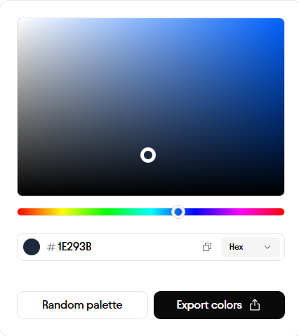
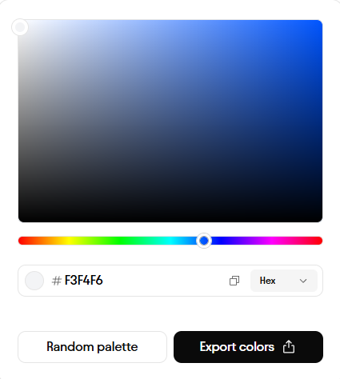
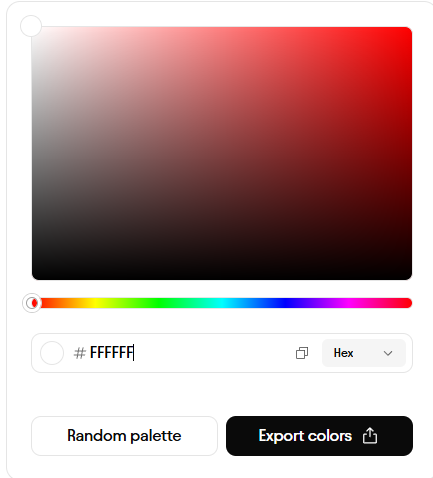
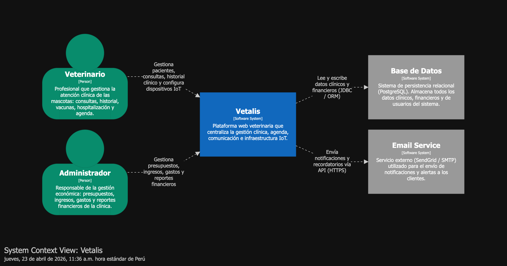
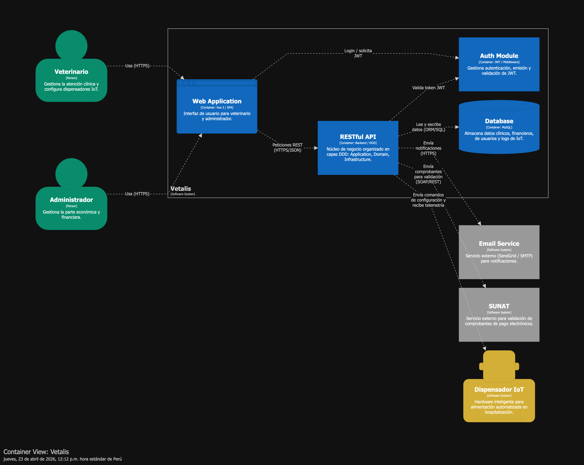
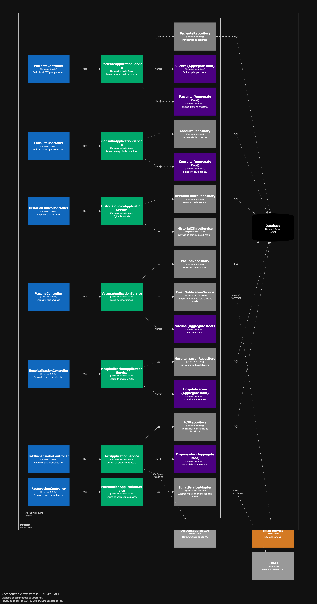

# Capítulo IV: Product Design

---

## 4.1. Style Guidelines

Vetalis, dedicado a la gestión eficiente, rápida y confiable del cuidado y salud de las mascotas, transmite calma, confianza, higiene y profesionalismo. Nuestra identidad visual combina colores relacionados al sector salud y cuidado animal (como variaciones de azules o verdes y tonos cálidos que denoten empatía) para evocar tranquilidad y seguridad en nuestros usuarios, junto a una tipografía clara y espacios limpios. Comunicamos con un lenguaje accesible, empático pero riguroso, transformando procesos médicos y de organización en soluciones prácticas para el bienestar de las mascotas y tranquilidad de sus dueños.

---

### 4.1.1. General Style Guidelines

**Logo:**
El logo de Vetalis fusiona elementos del cuidado animal y seguridad en un diseño representativo. Consiste en una silueta estilizada (como un escudo o corazón) que resguarda una huella de mascota, simbolizando nuestro compromiso con la protección y la salud de los animales. Esta imagen refleja cómo nuestra plataforma conecta tecnología moderna con el bienestar veterinario.

**Tipografía:**
La tipografía de la página debe ser accesible, limpia y altamente legible para adaptarse a cualquier dispositivo (pantallas de ordenador o móviles). Se emplea una fuente sans-serif (como Poppins o Roboto) debido a sus trazos modernos y limpios. Esto asegura que la lectura de historias clínicas, datos de citas y perfiles sea cómoda para profesionales y dueños de mascotas, resaltando el contenido sin distracciones visuales.

**Color Guide (Paleta de Colores):**

1. **Azul Marino Profundo (#1E293B)**
   *Representación:* El azul oscuro simboliza profesionalismo, autoridad, seguridad y confianza. En Vetalis, se utiliza para elementos estructurales como barras laterales (sidebars), menús de navegación, pies de página y texto principal grueso. Transmite la fiabilidad esencial en el ámbito de la salud clínica.

  

2. **Cian Vibrante / Turquesa (#06B6D4)**
   *Representación:* El cian cálido y vibrante evoca salud, frescura, empatía y energía moderna. Es el color principal de interacción (botones de acción, hipervínculos, indicadores de selección). Invita a los usuarios a interactuar en la plataforma manteniendo una vibra amigable, ideal para plataformas vinculadas al cuidado animal.

  

3. **Gris Claro Neutro (#F3F4F6)**
   *Representación:* Un color que transmite neutralidad y equilibrio. Funciona como un ancla visual que relaja la vista. Se emplea ampliamente como color de fondo en la aplicación web y landing page para destacar las tarjetas de información blanca (cards) y evitar la fatiga visual tras muchas horas de uso.

  

4. **Blanco Puro (#FFFFFF)**
   *Representación:* Simboliza la higiene clínica, pureza y orden. Es utilizado en los contenedores o tarjetas principales donde reside el contenido (como perfiles de mascotas, registros clínicos). Su propósito es ofrecer un espacio claro que separe la información de forma estructurada.

  

5. **Celeste Claro / Acento (#E0F2FE)**
   *Representación:* Un color complementario que aporta suavidad al diseño. Usado generalmente en etiquetas (tags), estados de hover en los botones secundarios o alertas de éxito.

  

**Buttons:**
La plataforma Vetalis cuenta con botones de diseño intuitivo y generoso manejo del espacio (padding) para evitar clics accidentales. Los **botones principales** (como "Agendar cita" o "Iniciar sesión") utilizan el *Cian Vibrante (#06B6D4)* con textos blancos para un alto contraste, indicando las acciones prioritarias. Los **botones secundarios** suelen incluir bordes sutiles o rellenos en colores más neutros. Todos mantienen bordes redondeados, lo cual disminuye la severidad y aumenta la sensación de amabilidad del sitio, con estados de *hover* que oscurecen ligeramente el color para dar un feedback táctil al usuario.

**Variaciones del logo en diferentes representaciones:**
- Versión principal detallada para headers y documentos oficiales.
- Versión minimalista: Únicamente el isotipo (la huella y el escudo) utilizado en la pestaña del navegador (favicon) o avatares de redes sociales.
- Versión monocromática: Aplicada a marcas de agua, y en interfaces donde el fondo ya cuenta con colores oscuros o saturados y requiere adaptarse estéticamente.

### 4.1.2. Web Style Guidelines

Para Vetalis, estamos desarrollando una plataforma web y una landing page enfocada en la gestión eficiente y el cuidado de la salud de las mascotas. Por ello, implementaremos un diseño adaptable (Web Responsive Design) que optimice la presentación de la información en diversas resoluciones y pantallas, ya sea computadora, tablet o smartphone. Esto garantizará que el contenido sea accesible y claro en todo momento, mejorando la experiencia tanto para dueños de mascotas como para profesionales veterinarios.

Como equipo, hemos decidido incorporar patrones de lectura visuales e intuitivos (como el patrón en forma de Z o F) para la página principal. Esta técnica es ideal para dirigir la atención de los visitantes hacia los elementos más importantes de Vetalis, como el objetivo del proyecto, los planes de suscripción, los beneficios de nuestra plataforma y el sistema de reservas. Colocaremos el logotipo de Vetalis en la esquina superior izquierda para reforzar la identidad y el reconocimiento de la marca, mientras que en la esquina superior derecha se encontrará una barra de navegación clara junto con un botón de llamado a la acción (Call to Action) destacado con nuestro color interactivo, que invite al usuario a registrarse o iniciar sesión rápidamente.

## 4.2. Information Architecture

---

### 4.2.1. Organization Systems

La información en Vetalis se diseña e implementa de manera modular y jerárquica para permitir a dueños y profesionales ubicar lo que necesitan velozmente, basándonos en la estructura mostrada en los mockups de la aplicación web:

- **Estructura basada en módulos claros:** Tal como se aprecia en el dashboard, la aplicación web divide sus funciones en apartados clave: Dashboard (Inicio), Agenda, Comunicación (Mensajes/Avisos), Historias Clínicas de Pacientes / Mascotas y Perfil de Usuario.
- **Jerarquización de contenidos:** Las funciones de uso recurrente y diario, como el número de mascotas atendidas, calendario o reportes visuales de ganancias/gastos (para el admin), se encuentran centralizados y destacados mediante tarjetas visuales (cards) ni bien se inicia sesión.

### 4.2.2. Labeling Systems

El etiquetado en Vetalis es fundamental para evitar confusiones de usabilidad. Por lo tanto, está redactado para ser conciso y familiar:

- **Uso de términos simples y de rápida comprensión:** En el menú lateral interactivo se usan etiquetas (labels) universales como: "Dashboard", "Agenda", "Comunicación", "Perfil" y "Log Out".
- **Reducción de tecnicismos complejos:** Para los dueños de mascotas, se prefiere un lenguaje neutro en las interfaces de usuario finales (como el uso de "Historial", "Citas" o "Mascotas"), garantizando un entorno amigable e intuitivo, manteniendo la formalidad correspondiente sin ser difícil de digerir.
- **Consistencia:** Mantener nombres iguales tanto en botones de menú, como en encabezados (headers) de sección para mantener una curva de aprendizaje mínima y no confundir al usuario.

### 4.2.3. SEO Tags and Meta Tags

Para lograr un buen posicionamiento web, captar tráfico orgánico de calidad y hacer de la Landing Page de Vetalis un sitio fácilmente encontrable:

- **Meta títulos:** Deberán integrar palabras clave precisas relacionadas al rubro como "Gestión Veterinaria", "Software Clínica Veterinaria", "Cuidado de Mascotas", y el propio nombre de marca "Vetalis".
- **Meta descripciones:** Claras, amigables e incluyendo llamadas a la acción directas (ejemplo: "Optimiza las citas de tu centro veterinario y acompaña a tus mascotas de la mejor manera. Regístrate en Vetalis").
- **Etiquetas Alt en Imágenes:** Cada imagen ilustrativa del landing page contará con textos descriptivos concisos para mejorar el rastreo por motores de búsqueda.
- **Estructura tipo Headings:** Correcta aplicación semántica de jerarquías H1, H2, H3 en secciones donde se enuncian beneficios y funciones para su correcta indexación.

### 4.2.4. Searching Systems

El sistema de búsqueda está pensado para una rápida asimilación por parte de los clínicos y tutores, con el objetivo de hallar información de inmediato:

- **Búsqueda interna intuitiva:** Utilizando barras de búsqueda posicionadas en las partes superiores de los paneles para que los profesionales puedan encontrar pacientes, clientes o detalles específicos en cuestión de segundos.
- **Autocompletado y Filtros:** Se dispondrán elementos que ofrezcan opciones al escribir datos, logrando que los resultados sean más dinámicos al, por ejemplo, filtrar citas por fechas específicas dentro de la "Agenda".

### 4.2.5. Navigation Systems

El ecosistema de navegación debe guiar al usuario por Vetalis fluidamente, evitando confusiones y sobrecarga visual:

- **Menú Principal Lateral (Sidebar):** Tal como observamos en la interfaz web diseñada (mockups), es un área vertical estática siempre visible en lado izquierdo, con íconos claros acompañando cada opción ("Dashboard", "Agenda", "Comunicación"), facilitando el salto fácil entre contextos.
- **Botones de llamado a la acción (CTAs):** Ubicados de forma destacada en la zona de trabajo (por ejemplo, para agregar nuevas mascotas, agendar nueva cita), usando el color primario de acento que indicamos en nuestros Style Guidelines.
- **Compatibilidad Responsive y Adaptabilidad:** Traslación del menú lateral global a un menú interactivo tipo "hamburguesa" accesible cuando el usuario inicia sesión desde un dispositivo móvil o comprimido, preservando que las opciones de "Perfil" y "Log Out" queden resguardadas con jerarquía.

## 4.3. Landing Page UI Design
***
### 4.3.1. Landing Page Wireframe
### 4.3.2. Landing Page Mock-up
## 4.4. Web Applications UX/UI Design
***
### 4.4.1. Web Applications Wireframes
### 4.4.2. Web Applications Wireflow Diagrams
### 4.4.3. Web Applications Mock-ups
### 4.4.4. Web Applications User Flow Diagrams
## 4.5. Web Applications Prototyping
***
## 4.6. Domain-Driven Software Architecture
***
### 4.6.1. Design-Level EventStorming
### 4.6.2. Software Architecture Context Diagram

### 4.6.3. Software Architecture Container Diagrams

### 4.6.4. Software Architecture Components Diagrams

## 4.7. Software Object-Oriented Design
***
### 4.7.1. Class Diagrams
## 4.8. Database Design
***
### 4.8.1. Database Diagrams
