# Capítulo V: Product Implementation, Validation & Deployment

En esta sección se mencionan las decisiones y convenciones las cuales permitirán mantener una consistencia durante el desarrollo del proyecto.

---

## 5.1. Software Configuration Management

---

### 5.1.1. Software Development Environment Configuration

**Project Management:**

La gestión de los proyectos tiene como objetivo mejorar los procesos y su entorno para alcanzar los resultados esperados.

* **Trello:** Es una herramienta visual que permite gestionar cualquier tipo de proyecto y el flujo de trabajo que el equipo desarrollador seguirá para implementar correctamente las tareas de código para el Landing Page y el Web Application.

| **URL:** | https://trello.com/es |
| :--- | :--- |

* **Pivotal Tracker:** Esta herramienta se define como una plataforma en la que se realiza la gestión de user stories, agrupándolos en epics y clasificando su presencia en el programa, por puntaje. Permite que cada miembro del equipo comparta la misma vista en tiempo real de lo que está sucediendo.

| **URL:** | https://www.pivotaltracker.com/ |
| :--- | :--- |

**Product UX/UI Design:**

Nos permite desarrollar el modelo en nuestro producto de manera digital y forme parte de la vida del consumidor. En este caso realizar un modelo de sitio web para computadoras y celulares.

* **Uxpressia:** Es una herramienta en línea para el mapeo de la trayectoria del cliente que crea mapas de impacto y personas. Sus herramientas nos permitieron establecer las bases del modelado de User Persona, Empathy Map y Journey Map.

| **URL:** | https://uxpressia.com/ |
| :--- | :--- |

* **MIRO:** Es una pizarra digital colaborativa en línea, que puede ser usada para la investigación, la ideación, la creación de lluvias de ideas, mapas mentales y una variedad de otras actividades colaborativas.

| **URL:** | https://www.miro.com/ |
| :--- | :--- |

* **Figma:** Es una herramienta de prototipo web y editor de gráficos vectorial alojada en la web, que permite establecer los modelos para las versiones de Web Browser y Landing Page.

| **URL:** | https://www.figma.com/ |
| :--- | :--- |

* **LucidChart:** Es una herramienta de diagramación basada en la web, que permite colaborar en tiempo real creando diseños UML, mapas mentales, prototipos de software, entre otros.

| **URL:** | https://www.lucidchart.com |
| :--- | :--- |

* **Structurizr:** Es una herramienta de diseño que soporta el modelo C4 para visualizar la arquitectura de software de nuestra solución.

| **URL:** | https://structurizr.com/ |
| :--- | :--- |

**Software Development:**

Representa el marco metodológico y técnico empleado para la construcción del producto. Esta estructura define los procesos y actividades específicas que guían el ciclo de vida del desarrollo, asegurando un enfoque organizado para cada etapa de la implementación.

* **GitHub:** Plataforma de alojamiento y gestión de repositorios que facilita el control de versiones y la colaboración técnica entre los integrantes del equipo Animatik.

| **URL:** | https://github.com/ |
| :--- | :--- |

* **WebStorm:** Entorno de desarrollo integrado (IDE) de JetBrains optimizado para el ecosistema web moderno, que agiliza la codificación, el refactorizado y las pruebas de la plataforma.

| **URL:** | https://www.jetbrains.com/webstorm/ |
| :--- | :--- |

* **HTML:** Lenguaje de marcado estándar utilizado para estructurar semánticamente el contenido y los componentes de la interfaz de usuario de Vetalis.

| **URL:** | https://www.jetbrains.com/help/webstorm/editing-html-files.html |
| :--- | :--- |

* **CSS:** Lenguaje de hojas de estilo encargado de la presentación visual, permitiendo implementar la identidad de marca y asegurar una experiencia estética coherente.

| **URL:** | https://www.jetbrains.com/help/webstorm/style-sheets.html#ws_css_completion |
| :--- | :--- |

* **TypeScript:** Lenguaje de programación de código abierto que añade tipado estático opcional a JavaScript, permitiendo un desarrollo más robusto, mantenible y escalable para la lógica de la solución veterinaria.

| **URL:** | https://www.typescriptlang.org/ |
| :--- | :--- |

* **Angular:** Framework de desarrollo para aplicaciones web diseñado por Google, utilizado para construir aplicaciones de una sola página (SPA) altamente eficientes mediante una arquitectura basada en componentes.

| **URL:** | https://angular.io/ |
| :--- | :--- |

* **GitHub Pages:** Servicio de despliegue que permite el alojamiento público de la Landing Page y las versiones preliminares de las aplicaciones web del proyecto.

| **URL:** | https://pages.github.com/ |
| :--- | :--- |

**Software Testing:**

Es el acto de examinar los artefactos y el comportamiento del software bajo prueba mediante validación y verificación.

* **Lenguaje Gherkin:** Es un DSL o Lenguaje Específico de Dominio, es decir, un lenguaje que está creado para resolver un problema. Se pueden agregar los user stories del programa con sus respectivas partes: Feature, Scenario, Example, Scenario Outline, Given, When, Then y And.

| **URL:** | https://cucumber.io/docs/gherkin/ |
| :--- | :--- |

### 5.1.2. Source Code Management

En esta sección se presenta la gestión de código fuente o como es conocido por sus siglas en inglés SCM (Source Code Management). Su función principal es realizar un seguimiento de las modificaciones que el equipo realizará a lo largo del desarrollo de sus proyectos en los repositorios de código fuente. Se emplea como un sistema de control de versiones que permite dar seguimiento a los cambios que cada integrante o desarrollador realice en el proyecto. Asimismo, cabe resaltar que para el sistema de control de versiones emplearemos GitHub.

**GitFlow**

Es el modelo alternativo de creación de ramas en Git que en los últimos años se ha vuelto una herramienta indispensable para muchos desarrolladores. Este flujo de trabajo de control de versiones utiliza ramas y fue publicado y popularizado por Vincent Driessen. Su principal función es ayudar en la organización de la versión de un código, permitiendo la creación de nuevos Features y Hotfixes de manera organizada.

**Main Branches:**

* **main:** es la rama principal, a partir de ella se recorrerán todas las ramas y contendrá la última versión y las anteriores creadas por los desarrolladores.
* **Develop:** Esta rama puede ser creada a partir de la rama main (master) y contará con todos los Features estables. Esto significa que a través de esta rama el equipo podrá integrar las funciones.

**Support Branches:**

* **Feature:** se ramifica de develop y al finalizar debe fusionarse de nuevo en develop. Se emplea para desarrollar nuevas funciones que se integrarán en versiones posteriores.
* **Release:** también se ramifica de develop, es la rama que admite la preparación de una nueva versión de producción.
* **Hotfix:** también está destinado a una nueva versión de producción, pero esta se ramifica de main. Su función es reparar rápidamente las publicaciones de producción.

**Conventional Commits:**

Son una convención para nombrar mensajes de commit en Git de forma estructurada, clara y semántica.

* **feat:** Se añade una nueva funcionalidad.
* **fix:** Se corrige un error.
* **docs:** Cambios en la documentación.
* **style:** Cambios de formato o estilo de código (sin impacto en la lógica).
* **refactor:** Mejoras en el código que no añaden nuevas funcionalidades ni corrigen errores.
* **test:** Añadir o modificar tests.
* **chore:** Cambios menores sin impacto en el código de producción (actualización de dependencias, configuración, etc.).

### 5.1.3. Source Code Style Guide & Conventions

El equipo ha definido un conjunto de reglas y estándares de programación con el objetivo de garantizar la legibilidad, mantenibilidad y coherencia del código en el proyecto Vetalis. Como regla transversal y obligatoria, toda la nomenclatura de los elementos del sistema se realizará en el idioma inglés.

#### General Naming Conventions

Se adoptan las convenciones de capitalización estándar para diferenciar la naturaleza de los componentes:

* **PascalCase:** Utilizado para nombres de clases e interfaces en Java.
* **camelCase:** Utilizado para variables locales, parámetros, nombres de métodos en Java y variables en TypeScript (Angular).
* **kebab-case:** Utilizado para nombres de archivos, selectores CSS (IDs y clases) y selectores de componentes de Angular.

#### HTML & CSS Style Guide

Basado en la Google HTML/CSS Style Guide y las directrices de la W3C:

* **HTML:** Uso obligatorio de etiquetas semánticas para mejorar el SEO y la accesibilidad. Se requiere una indentación de 2 espacios y el uso de comillas dobles para los atributos.
* **CSS:** Se prioriza el uso de selectores de clase. Las propiedades deben agruparse de manera lógica (posicionamiento, luego modelo de caja, luego tipografía). Se prohíbe el uso de estilos en línea (inline styles).

#### TypeScript & Angular Style Guide

Siguiendo la Google TypeScript Style Guide y la Angular Style Guide:

* **Sintaxis:** Uso de TypeScript (Arrow functions, destructuring y template literals). Se prefiere `const` para todas las declaraciones, usando `let` solo cuando sea estrictamente necesario.
* **Angular:** Los nombres de los componentes deben seguir la convención de incluir el tipo en el nombre del archivo (ej. `hero-detail.component.ts`) y los selectores deben usar el prefijo definido para el proyecto seguido de kebab-case.

#### Java & Spring Boot Coding Conventions

Siguiendo las Oracle Java Code Conventions y las guías de Spring Boot:

* **Estructura:** Las interfaces deben ser nombres descriptivos (aunque en Java no es obligatorio el prefijo "I", se mantiene por convención de equipo si se desea). Los campos privados deben utilizar camelCase estándar.
* **Inyección de Dependencias:** Se prefiere la inyección por constructor sobre la anotación `@Autowired` en campos, para facilitar las pruebas unitarias y garantizar la inmutabilidad.

#### Gherkin Conventions for Readable Specifications

Para la redacción de criterios de aceptación y pruebas de comportamiento:

* **Formato:** Uso riguroso de la estructura `Given / When / Then`.
* **Lenguaje:** Las especificaciones deben redactarse desde la perspectiva del negocio (usuario de la veterinaria), evitando tecnicismos de implementación en los pasos de Gherkin.

#### Referencias de Estándares Adoptados

| Tecnología | Referencia Principal |
| :--- | :--- |
| HTML / CSS | Google HTML/CSS Style Guide / W3C |
| TypeScript | Google TS Style Guide |
| Java | Oracle Java Code Conventions |
| Spring Boot | Spring Boot Coding Guidelines |
| Angular | Angular Style Guide |
| Gherkin | Gherkin Conventions for Readable Specifications |

### 5.1.4. Software Deployment Configuration

Como se mencionó previamente, la gestión de nuestro código fuente se realizará a través de GitHub. Asimismo, se utilizará GitHub Pages para la publicación y despliegue de la página.

Para el desarrollo del Landing Page de NeuroZen se han usado las siguientes herramientas:

* **HTML:** lenguaje con el cual está estructurado nuestro landing page.
* **CSS:** diseño y formato para el html desarrollado.

El despliegue de nuestro landing page es posible gracias a la herramienta de Github Pages. El cual es un servicio que nos permite alojar nuestro landing directamente desde el repositorio de GitHub.

Para lograr el despliegue seguimos los siguientes pasos:

1. Dirigirnos al repositorio de la página y entrar en la sección de configuración.
2. Ir a la opción de “Pages”, donde se encontrarán todas las opciones de publicación de página.
3. Se debe seleccionar la rama la cual se va a publicar en el vínculo. También se debe seleccionar la carpeta donde se localizara la publicación.
4. Finalmente, el link vínculo de nuestra página aparecerá en la parte superior.

## 5.2. Landing Page, Services & Applications Implementation

La construcción de la página de inicio, junto con los servicios y aplicaciones, es un paso fundamental en nuestro ciclo de desarrollo. Esto nos permite hacer realidad el diseño y las funciones proyectadas, convirtiendo las ideas iniciales en productos tangibles y listos para su uso. En esta fase traducimos los requerimientos y especificaciones a código fuente, estructurando la plataforma web según las necesidades detectadas.
***
### 5.2.1. Sprint 1

La primera iteración constituye un paso fundamental en nuestra metodología de desarrollo ágil. Durante este periodo, enfocaremos nuestra capacidad operativa en la construcción de las funcionalidades críticas y herramientas de alta prioridad establecidas en la fase de planificación. Este proceso consiste en traducir los requisitos técnicos y de negocio en componentes de software operativos, estableciendo los cimientos funcionales de nuestro producto bajo un modelo de mejora continua y entregas incrementales.

#### 5.2.1.1. Sprint Planning 1

| Sprint # | Sprint 1                                                                                                                                                                                                                                                                               |
| :--- |:---------------------------------------------------------------------------------------------------------------------------------------------------------------------------------------------------------------------------------------------------------------------------------------|
| **Sprint Planning Background** | Sesión de planificación inicial para establecer las bases del proyecto VetCare, priorizando la presencia web y la documentación técnica del primer hito académico.                                                                                                                     |
| **Date** | 2026-04-17                                                                                                                                                                                                                                                                             |
| **Time** | 07:00 PM                                                                                                                                                                                                                                                                               |
| **Location** | Google Meet (Reunión virtual)                                                                                                                                                                                                                                                          |
| **Prepared By** | Sejuro Medina, Mario Gabriel                                                                                                                                                                                                                                                           |
| **Attendees (to planning meeting)** | Gamero Miranda Lui Mathias/ Roman Zevallos, Sebastian Jared / Romero Vilela, Dario Alberto / Sanchez Benavente, Leonardo Matias / Sejuro Medina, Mario Gabriel                                                                                                                         |
| **Sprint 1 – 1 Review Summary** | Se lograron los hitos de desarrollo para los capítulos iniciales y el despliegue funcional de la Landing Page. No obstante, se identificó como punto de mejora la finalización de los entregables administrativos en formatos PDF y Word para cumplir con la totalidad del hito.       |
| **Sprint 1 – 1 Retrospective Summary** | El desempeño durante el primer ciclo fue aceptable, logrando un producto funcional aunque con oportunidades de optimización en la coordinación interna para futuros entregables de mayor complejidad técnica.                                                                          |
| **Sprint Goal & User Stories** |                                                                                                                                                                                                                                                                                        |
| **Sprint 1 Goal** | Lograr la culminación del reporte técnico y el despliegue exitoso de la Landing Page en el repositorio del equipo. La validación del éxito se mide mediante el flujo de tareas en el Board de Trello, asegurando que todos los ítems de prioridad alta alcancen el estado "Terminado". |
| **Sprint 1 Velocity** | 20                                                                                                                                                                                                                                                                                     |
| **Sum of Story Points** | 20                                                                                                                                                                                                                                                                                     |

La sesión de Sprint Planning es clave dentro de la metodología ágil, ya que en ella el equipo organiza con detalle las actividades de la siguiente iteración. Aquí se determinan las tareas a realizar, los tiempos estimados y los responsables. Su objetivo principal es trazar una hoja de ruta definida y realista, promoviendo el trabajo en equipo y garantizando que todos compartan la misma visión sobre las metas trazadas.

#### 5.2.1.2. Aspect Leaders and Collaborators

Durante la ejecución de la primera iteración, el equipo focalizó sus capacidades en el desarrollo integral de la presencia digital de *Vetalis, abordando los requerimientos priorizados dentro del **Epic 1: Landing Page (Static Web Site)*. La finalidad de este ciclo fue consolidar el canal de comunicación externa y habilitar los mecanismos de conversión para prospectos interesados en la plataforma.

*Historias de Usuario Abordadas*

| ID | Título | Descripción | Story Points | Asignado a | Estado |
| :--- | :--- | :--- |:------------------:| :--- | :---: |
| *US001* | View Value Proposition | Visualización de la propuesta de valor centrada en el ecosistema IoT y gestión integral en la home page. | 3 | Gamero Miranda, Lui Mathias | Done |
| *US002* | Select Veterinarian Segment | Implementación de la sección especializada para el perfil médico, detallando funciones de EHR y control nutricional. | 3 | Roman Zevallos, Sebastian Jared | Done |
| *US003* | Request Software Demo | Desarrollo del formulario de contacto para la captación de leads y registro de interés en dispositivos IoT. | 5 | Romero Vilela, Dario Alberto | Done |
| *US004* | View Pricing Plans | Maquetación de la tabla comparativa de planes de suscripción (Basic, Pro, Enterprise) y sus costos. | 3 | Sanchez Benavente, Leonardo Matias | Done |
| *US006* | Read Client Testimonials | Despliegue de la sección de prueba social con reseñas verificadas de administradores y médicos veterinarios. | 3 | Sejuro Medina, Mario Gabriel | Done |
| *US008* | View Mobile Menu | Implementación del sistema de navegación responsiva (menú hamburguesa) para optimizar la experiencia en smartphones. | 5 | Sanchez Benavente, Leonardo Matias | Done |

Evidencia del avance en Trello:

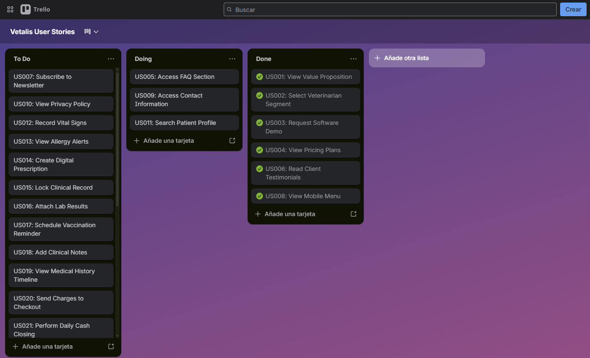

*URL:* https://trello.com/invite/b/69ea5e4e6743746b9259cdec/ATTI07c5209f0d55628672b1d547ef9c38243661ADA5/vetalis-user-stories

Este primer ciclo de trabajo concluyó con la entrega funcional de la Landing Page de Vetalis, ofreciendo a los usuarios un acercamiento inicial a la propuesta de valor integral. El sitio permite explorar las herramientas de gestión administrativa, las funcionalidades diseñadas para el sector clínico veterinario y la automatización IoT, integrando además testimonios de la industria y datos generales sobre el ecosistema de la aplicación.

#### 5.2.1.3. Sprint Backlog 1

| Sprint # | Sprint 1 |
| :--- | :--- |

| User Story / Task Id | Title | Description | Estimation (Hours) | Assigned To | Status |
| :--- | :--- | :--- |:------------------:| :--- | :---: |
| *WK01* | Configuración del entorno de desarrollo | Establecimiento de la organización en GitHub, definición de la estrategia de ramas (GitFlow) y configuración del tablero en Trello. | 2 | Todos los miembros del equipo | Done |
| *WK02* | Finalización del Capítulo 01 | Elaboración de la descripción de la startup Animatik, perfiles de los integrantes y definición estratégica de la solución. | 4 | Todos los miembros del equipo | Done |
| *WK03* | Finalización del Capítulo 02 | Documentación de User Personas, Empathy Maps, análisis competitivo y diseño de entrevistas para el needfinding. | 6 | Todos los miembros del equipo | Done |
| *WK04* | Finalización del Capítulo 03 | Redacción de User Stories detalladas, elaboración del Impact Mapping y organización del Product Backlog prioritario. | 6 | Todos los miembros del equipo | Done |
| *WK05* | Finalización del Capítulo 04 | *Fase de Diseño Detallado:* Definición de lineamientos de estilo, arquitectura de información y creación de Wireframes y Mockups de alta fidelidad. | 9 | Todos los miembros del equipo | Done |
| *WK06* | Finalización del Capítulo 05 | *Configuración de Implementación:* Documentación de la gestión de configuración de software, convenciones de código y evidencia de despliegue. | 8 | Todos los miembros del equipo | Done |
| *US001* | View Value Proposition | Implementación en la home page de la propuesta de valor enfocada en la automatización de alimentación IoT y gestión clínica. | 3 | Lui Mathias Gamero Miranda | Done |
| *US002* | Select Veterinarian Segment | Desarrollo de la sección detallada para el perfil médico sobre EHR, prescripciones y control nutricional remoto. | 3 | Roman Zevallos, Sebastian Jared | Done |
| *US003* | Request Software Demo | Creación del formulario de contacto para la captación de leads y registro del interés en la integración IoT en la base de datos. | 5 | Romero Vilela, Dario Alberto | Done |
| *US004* | View Pricing Plans | Maquetación de la tabla comparativa de los niveles de suscripción (Basic, Pro y Enterprise) y sus beneficios financieros. | 3 | Sanchez Benavente, Leonardo Matias | Done |
| *US006* | Read Client Testimonials | Implementación del carrusel de testimonios verificados de administradores y veterinarios para fortalecer la confianza en el producto. | 3 | Sejuro Medina, Mario Gabriel | Done |
| *US008* | View Mobile Menu | Desarrollo y adaptación del menú hamburguesa responsivo para garantizar la navegación fluida en dispositivos móviles. | 5 | Sanchez Benavente, Leonardo Matias | Done |

#### 5.2.1.4. Development Evidence for Sprint Review

En este apartado se detallan los progresos realizados en la fase de implementación de los componentes de la solución vinculados al alcance del presente Sprint: Landing Page y la base documental del proyecto.

Inicialmente, se exponen los commits más significativos realizados en el repositorio del Informe, los cuales evidencian la evolución de la estructura estratégica y técnica de *Vetalis*:

| Repository | Branch | Commit Message | Commit ID |
| :--- | :---: | :--- | :---: |
| /Report | main | docs: chapter 1 structure and startup profile finalized | 50c76ce |
| /Report | develop | feat: chapter 3 user stories and impact mapping | 32f741a |
| /Report | develop | docs: update style guidelines and information architecture | 6940803 |

*Registro de Commits de Documentación y Diseño*

A continuación, se presenta el registro detallado de las contribuciones destinadas a la estructuración de los primeros capítulos y el diseño de la experiencia de usuario:

| Autor | Fecha | Commit Message | Commit ID |
| :--- | :---: | :--- | :---: |
| Sanchez Benavente, Leonardo Matias | 16/04/2026 | docs: añade segmentos objetivo en chapter-01 | f052994 |
| Roman Zevallos, Sebastian Jared | 16/04/2026 | docs(chapter-03): refine user story descriptions | 948f654 |
| Lui Mathias Gamero Miranda | 17/04/2026 | Update chapter-04.md assets and color palette | 33c063c |
| Sejuro Medina, Mario Gabriel | 17/04/2026 | docs(chapter-02): update customer journey maps | f0197b2 |
| Romero Vilela, Dario Alberto | 17/04/2026 | docs: add empathy maps for veterinarian segment | 96423a6 |
| Sejuro Medina, Mario Gabriel | 20/04/2026 | docs(chapter-05): finalize sprint backlog 1 | 9367375 |
| Roman Zevallos, Sebastian Jared | 20/04/2026 | docs: software development environment setup | 6479f15 |
| Romero Vilela, Dario Alberto | 20/04/2026 | docs(chapter-02): add event storming diagrams | cdf0e31 |
| Lui Mathias Gamero Miranda | 19/04/2026 | docs: update high-fidelity mockups for landing page | de62be9 |

#### 5.2.1.5. Execution Evidence for Sprint Review

En esta entrega, el equipo de desarrolladores de Vetalis ha completado con éxito la implementación y el lanzamiento de la página de la Landing Page. Esta página presenta diferentes secciones que brindan información detallada sobre nuestro producto.

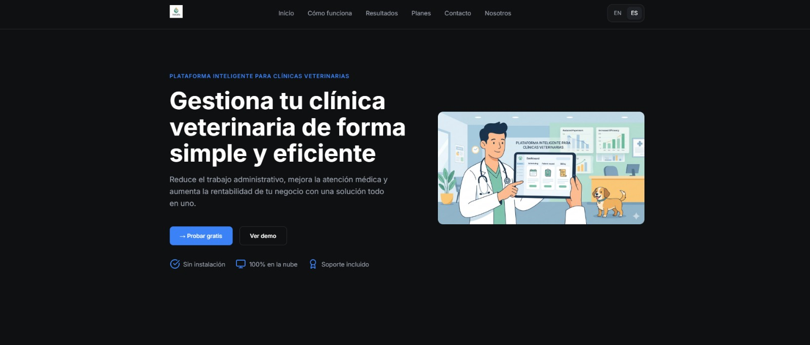
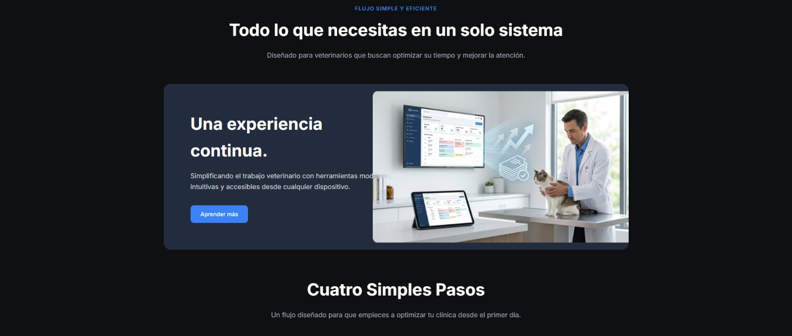
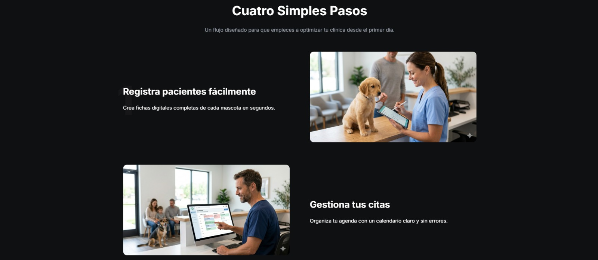
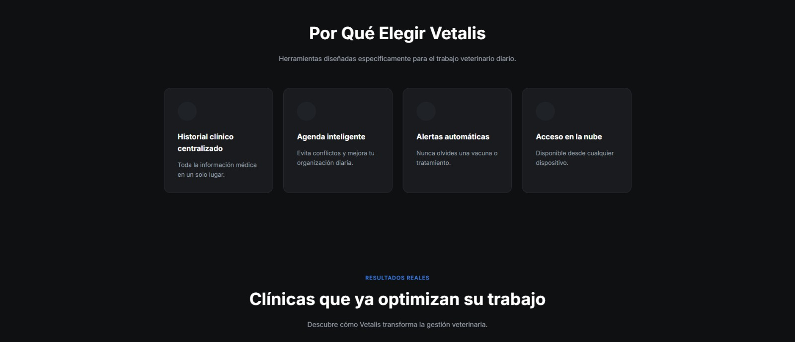
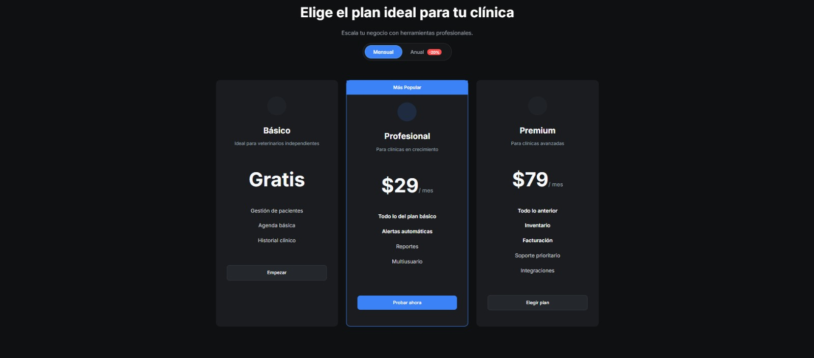
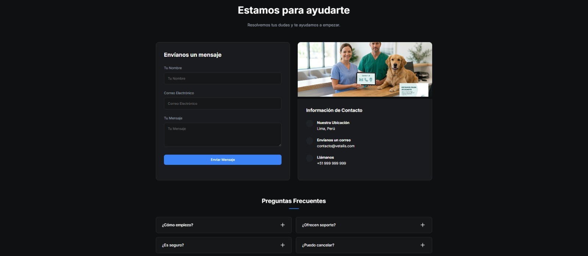
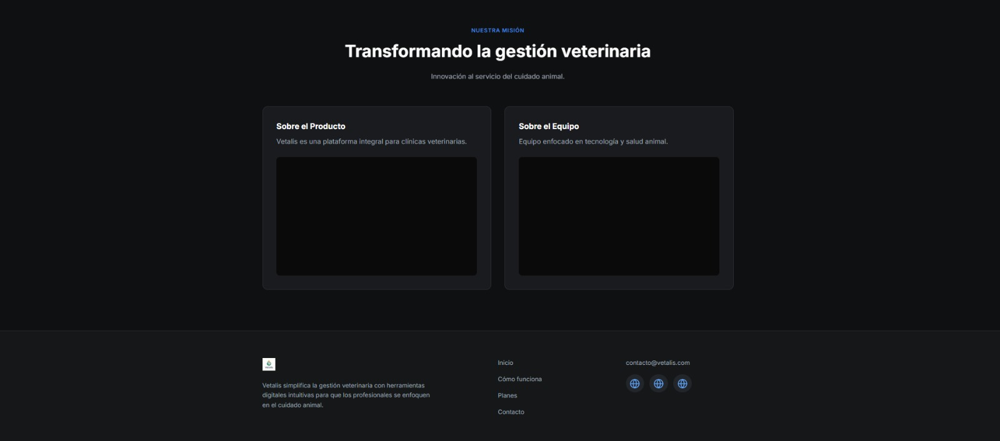

#### 5.2.1.6. Services Documentation Evidence for Sprint Review

Durante el Sprint 1, se llevó a cabo la publicación de la Landing Page de Vetalis empleando GitHub Pages como servicio de hosting. A continuación, se detallan las acciones realizadas para lograr su despliegue exitoso.

Se creó el repositorio denominado Vetalis-Landing-Page dentro de la organización 1ASI0729-2610-10177-Animatik-Vetalis en GitHub.

El desarrollo de la Landing Page se realizó en la rama develop, siguiendo el modelo de trabajo GitFlow, donde se implementaron secciones como hero, problemática, beneficios, startup, planes y footer.

Tras validar el contenido, se efectuó la fusión de la rama develop hacia main mediante un Pull Request, lo que permitió activar automáticamente el despliegue del sitio a través de GitHub Pages.

Se verificó el despliegue exitoso accediendo a la URL pública: https://1asi0729-2610-10177-animatik-vetalis.github.io/Vetalis-Landing/

---
#### 5.2.1.7. Software Deployment Evidence for Sprint Review

Se desplegó la landing page usando el servicio de GitHub Pages. Se configuró para utilizar la rama main como base del proyecto a desplegar.

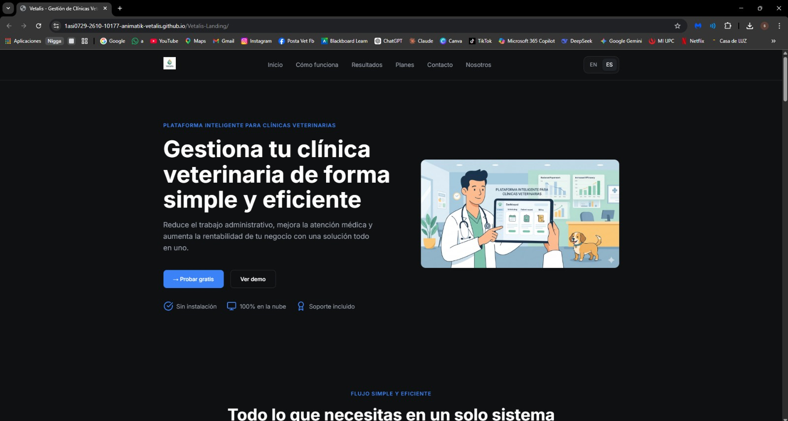

URL de Landing Page Desplegada: https://1asi0729-2610-10177-animatik-vetalis.github.io/Vetalis-Landing/

---
#### 5.2.1.8. Team Collaboration Insights during Sprint
A continuación todos los analíticos que nos proporciona Github, en su apartado de Insights, sobre la colaboración del equipo durante el Sprint 1:
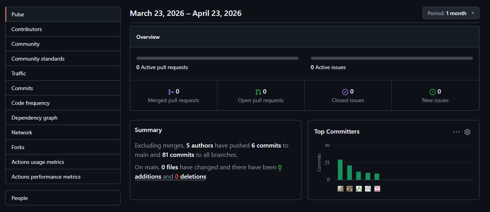

### 5.2.2. Sprint 2

La segunda iteración representa un avance consecuente en nuestra metodología de desarrollo ágil. Durante este periodo, enfocaremos nuestra capacidad operativa en la construcción y despliegue de la aplicación web frontend, priorizando las interfaces interactivas de gestión clínica establecidas en la fase de planificación. Este proceso consiste en traducir los requisitos de experiencia de usuario y lógica de negocio en componentes visuales operativos, expandiendo los cimientos funcionales de nuestro producto hacia una solución de software interactiva bajo un modelo de mejora continua y entregas incrementales.

### 5.2.2.1. Sprint Planning 2

| Sprint # | Sprint 2                                                                                                                                                                                                                                         |
| :--- |:-------------------------------------------------------------------------------------------------------------------------------------------------------------------------------------------------------------------------------------------------|
| **Sprint Planning Background** |                                                                                                                                                                                                                                                  |
| Date | 2026-05-11                                                                                                                                                                                                                                       |
| Time | 05:00 PM                                                                                                                                                                                                                                         |
| Location | Google Meet (Reunión virtual)                                                                                                                                                                                                                         |
| Prepared By | Gamero Miranda, Lui Mathias                                                                                                                                                                                                                      |
| Attendees (to planning meeting) | Gamero Miranda, Lui Mathias / Roman Zevallos, Sebastian Jared / Romero Vilela, Dario Alberto / Sanchez Benavente, Leonardo Matias / Sejuro Medina, Mario Gabriel                                                                                 |
| **Sprint 1 Review Summary** | Se logró implementar y desplegar exitosamente la primera versión del Landing Page estático con HTML5, CSS3 y JavaScript. Se validó correctamente la presentación de la propuesta de valor y los planes de precios ante el Product Owner.         |
| **Sprint 1 Retrospective Summary** | El equipo identificó que la comunicación durante el control de versiones fue fluida gracias a GitFlow, pero se acordó mejorar la estimación de tiempos en el diseño responsivo para evitar sobrecargas de tareas en los últimos días del sprint. |
| **Sprint Goal & User Stories** |                                                                                                                                                                                                                                                  |
| Sprint 2 Goal | Nuestro enfoque es desplegar el frontend de gestión clínica. Creemos que facilitará a los veterinarios el manejo de triajes e historiales. Se confirmará cuando los usuarios naveguen por la aplicación Angular y sus módulos básicos.           |
| Sprint 2 Velocity | 34                                                                                                                                                                                                                                               |
| Sum of Story Points | 34                                                                                                                                                                                                                                               |

La sesión de Sprint Planning es clave dentro de nuestra metodología ágil, ya que nos permitió organizar con detalle las actividades de esta segunda iteración. Durante la reunión, determinamos las tareas específicas para la configuración y desarrollo del frontend, asignamos los tiempos estimados y definimos a los responsables de cada módulo clínico. El objetivo principal fue trazar una hoja de ruta definida y realista para la implementación de las interfaces de usuario, promoviendo el trabajo en equipo y garantizando que todos compartamos la misma visión sobre las metas trazadas para el despliegue de la aplicación web.

### 5.2.2.2. Aspect Leaders and Collaborators

Durante la ejecución de la segunda iteración, el equipo focalizó sus capacidades en el desarrollo y estructuración de la aplicación web frontend, abordando los requerimientos priorizados dentro del Epic 2: Clinical Management - EHR (Veterinarian). La finalidad de este ciclo fue consolidar las interfaces operativas de la plataforma y habilitar los módulos interactivos de triaje, prescripción e historial médico para optimizar el flujo de trabajo diario de los profesionales veterinarios.

| Team Member (Last Name, First Name) | GitHub Username   | Configuración y Despliegue Frontend Leader (L) / Collaborator (C) | Módulo de Búsqueda y Alertas Leader (L) / Collaborator (C) | Módulo de Historial y Recetas Leader (L) / Collaborator (C) | Módulo de Triaje Leader (L) / Collaborator (C) |
| :--- |:------------------| :---: | :---: | :---: | :---: |
| Gamero Miranda, Lui Mathias | lug07m            | L | C | C | C |
| Roman Zevallos, Sebastian Jared | Chebas19          | C | C | L | C |
| Romero Vilela, Dario Alberto | patatitis9-alt    | C | C | L | C |
| Sanchez Benavente, Leonardo Matias | Matiassb06        | C | C | C | L |
| Sejuro Medina, Mario Gabriel | maghetthi         | C | L | C | C |

### 5.2.2.3.Sprint Backlog 2.
| Sprint # | Sprint 2 |
| :--- | :--- |

| User Story / Task Id | Title | Description | Estimation (Hours) | Assigned To | Status |
| :--- | :--- | :--- |:------------------:| :--- | :---: |
| *WK07* | Configuración y Despliegue del Frontend | Configuración del entorno de desarrollo en Angular y despliegue de la primera versión de la Web Application en la nube, generando la URL pública. | 5 | Todos los miembros del equipo | To Do |
| *US011* | Search Patient Profile | Desarrollo de la barra de búsqueda y vista de resultados para localizar rápidamente los perfiles y el historial médico de los pacientes. | 6 | Sejuro Medina, Mario Gabriel | To Do |
| *US012* | Record Vital Signs | Maquetación e implementación del formulario para el registro de los signos vitales (peso y temperatura) durante el proceso de triaje. | 5 | Sanchez Benavente, Leonardo Matias | To Do |
| *US013* | View Allergy Alerts | Implementación visual de alertas de alta prioridad (banners) en la vista del historial clínico para notificar alergias del paciente. | 4 | Gamero Miranda, Lui Mathias | To Do |
| *US014* | Create Digital Prescription | Desarrollo del módulo de recetas médicas para la generación de prescripciones digitales y planes nutricionales estandarizados. | 8 | Romero Vilela, Dario Alberto | To Do |
| *US019* | View Medical History Timeline | Maquetación de la línea de tiempo cronológica para visualizar de forma ordenada el historial de consultas pasadas del paciente. | 6 | Roman Zevallos, Sebastian Jared | To Do |

Evidencia del avance en Trello:

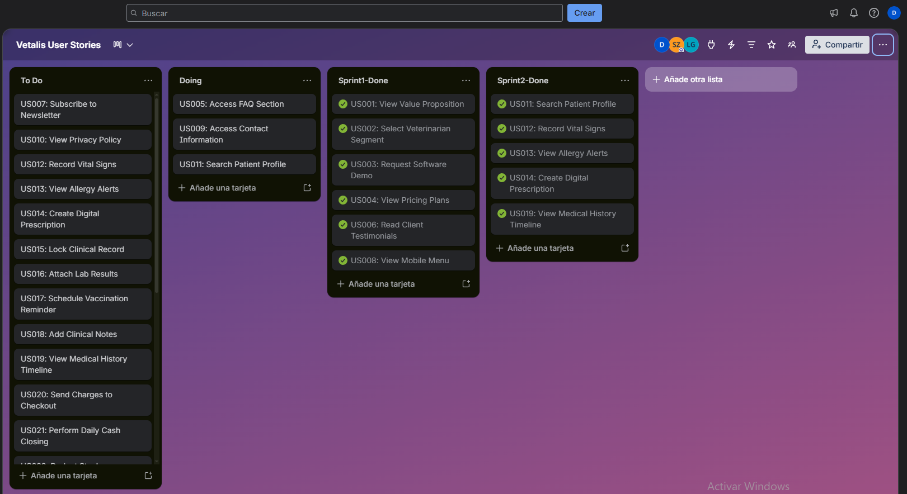

*URL:* https://trello.com/invite/b/69ea5e4e6743746b9259cdec/ATTI07c5209f0d55628672b1d547ef9c38243661ADA5/vetalis-user-stories

Este segundo ciclo de trabajo concluyó con la entrega funcional de la aplicación web frontend de Animatik, permitiendo a los médicos veterinarios interactuar directamente con los módulos de gestión clínica. La plataforma ahora facilita la búsqueda ágil de pacientes, el registro de signos vitales durante el triaje y la gestión de historiales médicos digitales, integrando una interfaz responsiva desplegada en la nube que optimiza la operatividad y la atención diaria en la clínica.

### 5.2.2.4.Development Evidence for Sprint Review.

En este apartado se detallan los commits más significativos realizados en el repositorio durante el Sprint 2:

| Repository | Branch | Commit id | Commit message | Commited on (Date) |
| :--- | :---: | :---: | :--- | :---: |
| Vetalis-Frontend | main | bef77e0 | feat(main): add schedule.html, schedule.css, and schedule.ts | 12/05/2026 |
| Vetalis-Frontend | main | da539b3 | feat(main): add dashboard.html and profile.css | 12/05/2026 |
| Vetalis-Frontend | main | 3c2d25e | feat(main): add profile html and ts files | 12/05/2026 |
| Vetalis-Frontend | main | 7e66bba | feat(main): add comunication | 12/05/2026 |
| Vetalis-Frontend | main | cd62339 | Vetalis-Frontend | 12/05/2026 |

### 5.2.2.5.Execution Evidence for Sprint Review.

Durante este segundo Sprint, el equipo avanzó en la implementación de la aplicación web frontend, logrando una interfaz interactiva, visualmente coherente y adaptable a diferentes dispositivos para los módulos de gestión clínica. A continuación se muestra la evidencia visual de las secciones desplegadas, mostrando la navegación de la plataforma.

1. Dashboard - Panel Principal:

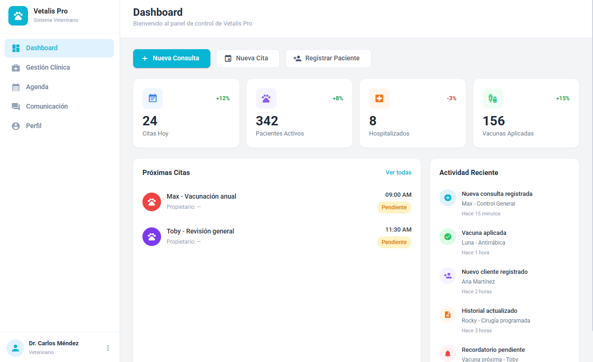

2. Perfil de Usuario (Profile):

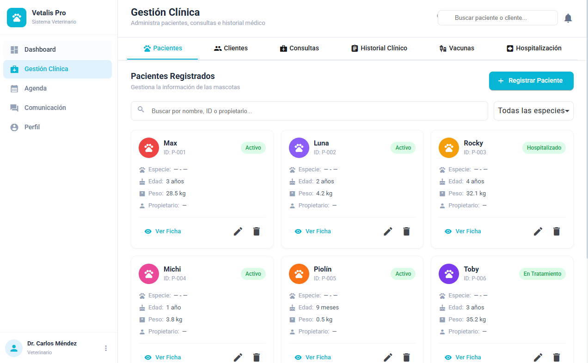

3. Calendario/Agenda (Schedule):

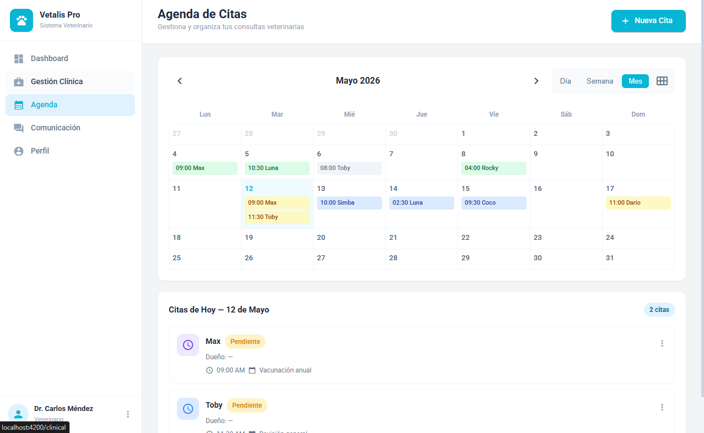

4. Comunicación (Comunication):

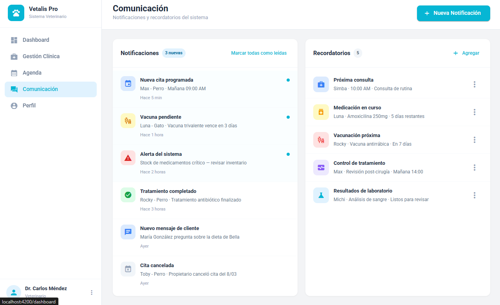

5. Otras vistas de gestión:

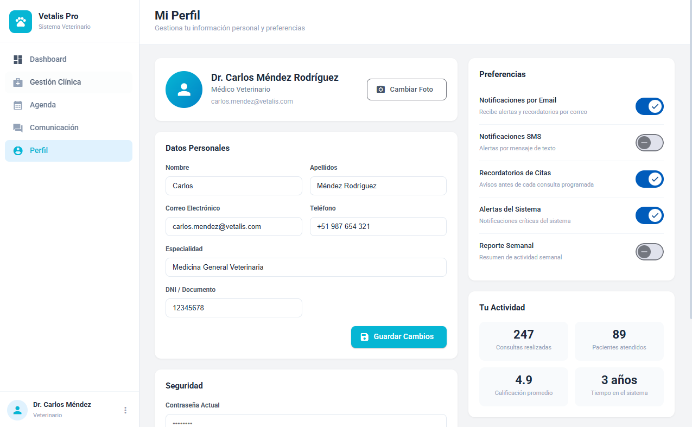

### 5.2.2.6.Services Documentation Evidence for Sprint Review.

Durante este Sprint 2, el equipo desplegó una Fake API REST utilizando My JSON Server / Render, la cual simula los endpoints del backend de Vetalis y permite al frontend consumir datos reales durante el desarrollo. A continuación se presenta la URL del servicio desplegado:

**URL de la Fake API:** https://vetalis-api.onrender.com/

A continuación, se presentan los commits que evidencian la construcción e integración de servicios y componentes para el Frontend:

<table>
  <thead>
    <tr>
      <th>Repository</th>
      <th>Branch</th>
      <th>Commit ID</th>
      <th>Commit message</th>
      <th>Commit Message body</th>
      <th>Commit on (date)</th>
    </tr>
  </thead>
  <tbody>
    <tr>
      <td rowspan="5" align="center" valign="middle">Vetalis- Frontend</td>
      <td align="center">main</td>
      <td align="center">cd62339</td>
      <td>Vetalis-Frontend</td>
      <td>Configuración base inicial del repositorio del frontend.</td>
      <td align="center">12/05/2026</td>
    </tr>
    <tr>
      <td align="center">main</td>
      <td align="center">7e66bba</td>
      <td>feat(main): add comunication</td>
      <td>Desarrollo e integración del módulo de comunicación.</td>
      <td align="center">12/05/2026</td>
    </tr>
    <tr>
      <td align="center">main</td>
      <td align="center">3c2d25e</td>
      <td>feat(main): add profile html and ts files</td>
      <td>Agregada la estructura HTML y la lógica en TypeScript para el perfil.</td>
      <td align="center">12/05/2026</td>
    </tr>
    <tr>
      <td align="center">main</td>
      <td align="center">da539b3</td>
      <td>feat(main): add dashboard.html and profile.css</td>
      <td>Creación de la vista del dashboard y estilos asociados al perfil.</td>
      <td align="center">12/05/2026</td>
    </tr>
    <tr>
      <td align="center">main</td>
      <td align="center">bef77e0</td>
      <td>feat(main): add schedule.html, schedule.css, and schedule.ts</td>
      <td>Implementación de las vistas y estilos para el módulo de agenda (schedule).</td>
      <td align="center">12/05/2026</td>
    </tr>
  </tbody>
</table>

### 5.2.2.7.Software Deployment Evidence for Sprint Review.

El despliegue de la aplicación web frontend se realizó utilizando GitHub Pages, aprovechando la integración directa con el repositorio del proyecto. Esta configuración permite que el sitio sea accesible públicamente y se actualice automáticamente con cada cambio en la rama principal.

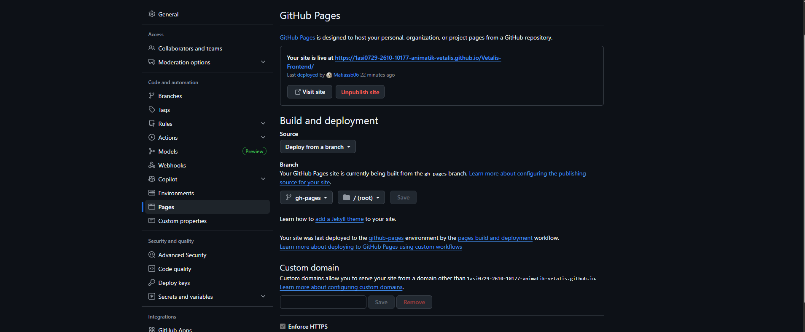

**URL:** https://1asi0729-2610-10177-animatik-vetalis.github.io/Vetalis-Frontend/

### 5.2.2.8.Team Collaboration Insights during Sprint.

Durante el Sprint 2, nuestra colaboración se centró principalmente en la estructuración y desarrollo de la aplicación web frontend, así como en la actualización de la base documental. El equipo utilizó Trello y GitFlow para la gestión de tareas y control de versiones, asegurando que cada módulo (Dashboard, Perfil, Agenda) fuera implementado correctamente y a tiempo.

**Gráfico de Contribuciones del equipo**

**Contribuciones al desarrollo del Frontend:**

**Contribuciones al desarrollo del Documento:**

### 5.2.3. Sprint 3

#### 5.2.3.1. Sprint Planning 3

| Sprint # | Sprint 3 |
|---|---|
| **Sprint Planning Background** | Sesión de planificación enfocada en la implementación y despliegue de la primera versión de los Web Services (RESTful API) en Java con Spring Boot, garantizando la persistencia de datos y la lógica de negocio para los módulos de gestión de la plataforma. |
| **Date** | 14/06/2026 |
| **Time** | 05:00 PM |
| **Location** | Google Meet |
| **Prepared By** | Sejuro Medina, Mario Gabriel |
| **Attendees (to planning meeting)** | Gamero Miranda, Lui Mathias / Roman Zevallos, Sebastian Jared / Romero Vilela, Dario Alberto / Sanchez Benavente, Leonardo Matias / Sejuro Medina, Mario Gabriel |
| **Sprint 2 Review Summary** | Se logró implementar y desplegar exitosamente la aplicación web frontend en Angular mediante GitHub Pages. Se validaron las vistas de triaje, agenda y dashboard. |
| **Sprint 2 Retrospective Summary** | El equipo identificó que la integración de vistas tomó más tiempo del esperado. Se acordó mejorar la estimación de tiempos técnicos para la creación de los endpoints del backend y mantener la fluidez en el control de versiones con GitFlow. |
| **Sprint 3 Goal** | Nuestro enfoque es desplegar la primera versión de Web Services. Creemos que brindará la lógica de negocio y persistencia de datos al frontend. Se confirmará cuando los endpoints de historias clínicas y autenticación respondan a las peticiones del cliente y estén documentados con Swagger. |
| **Sprint 3 Velocity** | 23 |
| **Sum of Story Points** | 23 |

#### 5.2.3.2. Aspect Leaders and Collaborators

| Team Member (Last Name, First Name) | GitHub Username | API Development Leader (L) / Collaborator (C) | Database Integration Leader (L) / Collaborator (C) | API Documentation Leader (L) / Collaborator (C) | Software Deployment Leader (L) / Collaborator (C) |
| :--- | :--- | :--- | :--- | :--- | :--- |
| Gamero Miranda, Lui Mathias | lug07m | C | C | C | L |
| Roman Zevallos, Sebastian Jared | Chebas19 | C | L | C | C |
| Romero Vilela, Dario Alberto | patatitis9-alt | L | C | C | C |
| Sanchez Benavente, Leonardo Matias | Matiassb06 | C | C | C | C |
| Sejuro Medina, Mario Gabriel | blackdollie | C | C | L | C |

#### 5.2.3.3. Sprint Backlog 3

| Sprint # | Sprint 3 | | | | |
| :--- | :--- | :--- | :--- | :--- | :--- |
| **User Story Id** | **Title** | **Description** | **Estimation (Hours)** | **Assigned To** | **Status** |
| TS001 | Retrieve Patient History Endpoint | Crear un GET endpoint en Java para recuperar el historial médico. | 5 | Roman Zevallos, Sebastian Jared | Done |
| TS003 | Validate JWT Authentication | Implementar middleware de autenticación JWT para proteger los endpoints. | 5 | Romero Vilela, Dario Alberto | Done |
| TS005 | Create New Appointment Endpoint | Construir un POST endpoint para programar citas en el calendario. | 5 | Sanchez Benavente, Leonardo Matias | Done |
| TS007 | User Login & Token Generation | Implementar un POST endpoint para el inicio de sesión y emisión de JWT. | 5 | Gamero Miranda, Lui Mathias | Done |
| TS010 | Validate Token Endpoint | Crear un endpoint que verifique si un JWT sigue activo. | 3 | Sejuro Medina, Mario Gabriel | Done |

Evidencia del trello: 
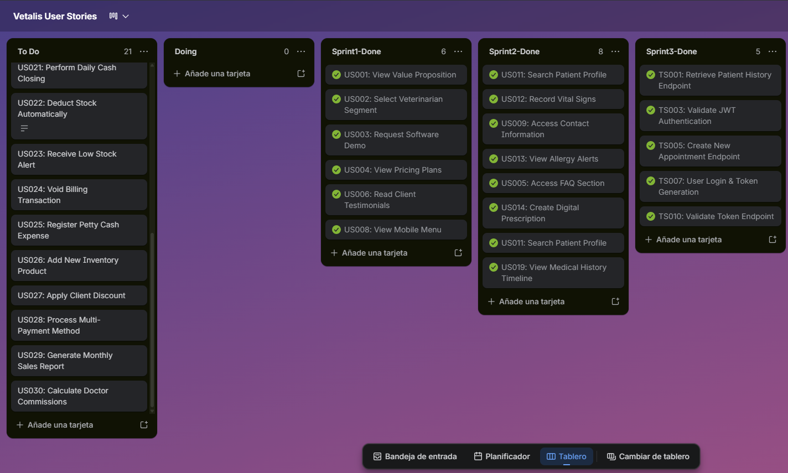
Enlace del trello: https://trello.com/invite/b/69ea5e4e6743746b9259cdec/ATTI07c5209f0d55628672b1d547ef9c38243661ADA5/vetalis-user-stories

#### 5.2.3.4. Development Evidence for Sprint Review

Se detalla a continuación el registro de los commits más significativos orientados a la construcción de los Web Services y la integración con la base de datos:

<table>
  <thead>
    <tr>
      <th>Repository</th>
      <th>Branch</th>
      <th>Commit Id</th>
      <th>Commit Message</th>
      <th>Commit Message Body</th>
      <th>Commited on (Date)</th>
    </tr>
  </thead>
  <tbody>
    <tr>
      <td rowspan="7" align="center" valign="middle">Vetalis- Backend</td>
      <td align="center">main</td>
      <td align="center">20a09bd</td>
      <td>add src and root</td>
      <td>Configuración base inicial del proyecto Spring Boot y estructura raíz del repositorio.</td>
      <td align="center">19/06/2026</td>
    </tr>
    <tr>
      <td align="center">main</td>
      <td align="center">ce0663f</td>
      <td>feat: add bounded context clients</td>
      <td>Implementación del bounded context de clientes con sus respectivos endpoints REST.</td>
      <td align="center">19/06/2026</td>
    </tr>
    <tr>
      <td align="center">main</td>
      <td align="center">22b34f8</td>
      <td>feat: add boundend context clinical</td>
      <td>Desarrollo del bounded context clínico con gestión de historiales médicos y triaje.</td>
      <td align="center">19/06/2026</td>
    </tr>
    <tr>
      <td align="center">main</td>
      <td align="center">e2f49d1</td>
      <td>feat: add bounded context dashboard and iam</td>
      <td>Implementación del bounded context de dashboard y módulo de Identity & Access Management con JWT.</td>
      <td align="center">19/06/2026</td>
    </tr>
    <tr>
      <td align="center">main</td>
      <td align="center">1dba316</td>
      <td>feat: add bounded context inventory</td>
      <td>Desarrollo del bounded context de inventario con control de stock y alertas de medicamentos.</td>
      <td align="center">19/06/2026</td>
    </tr>
    <tr>
      <td align="center">main</td>
      <td align="center">9ddcc9f</td>
      <td>feat: add boundend context iot</td>
      <td>Implementación del bounded context IoT para la gestión de dispositivos de alimentación automática.</td>
      <td align="center">19/06/2026</td>
    </tr>
    <tr>
      <td align="center">main</td>
      <td align="center">b53804c</td>
      <td>feat: add schedule and shared bounded contexts</td>
      <td>Desarrollo del bounded context de agenda y componentes compartidos entre los módulos del sistema.</td>
      <td align="center">19/06/2026</td>
    </tr>
  </tbody>
</table>

Evidencia de los commits realizados en el repositorio Vetalis-Backend durante el Sprint 3:

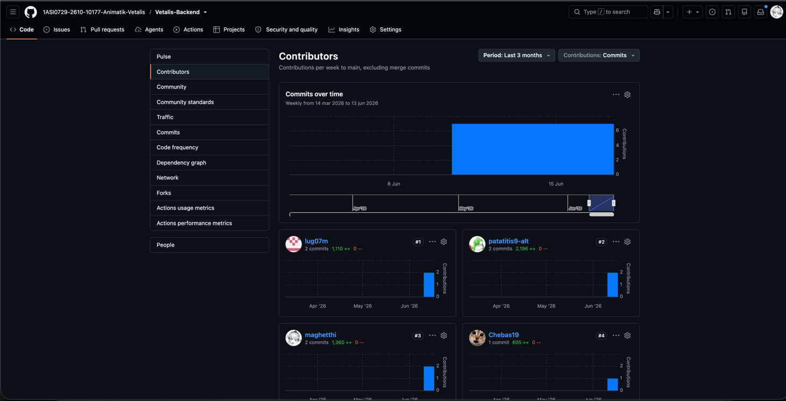

#### 5.2.3.5. Execution Evidence for Sprint Review

Se implementaron los servicios RESTful requeridos para el funcionamiento de la plataforma. A través de clientes HTTP se verificó que los controladores procesen correctamente las solicitudes JSON, apliquen la seguridad JWT y retornen los códigos de estado correspondientes a la lógica de negocio.

A continuación se muestra la evidencia visual de la documentación interactiva de la API desplegada con Swagger, donde se pueden observar los endpoints operativos del backend:

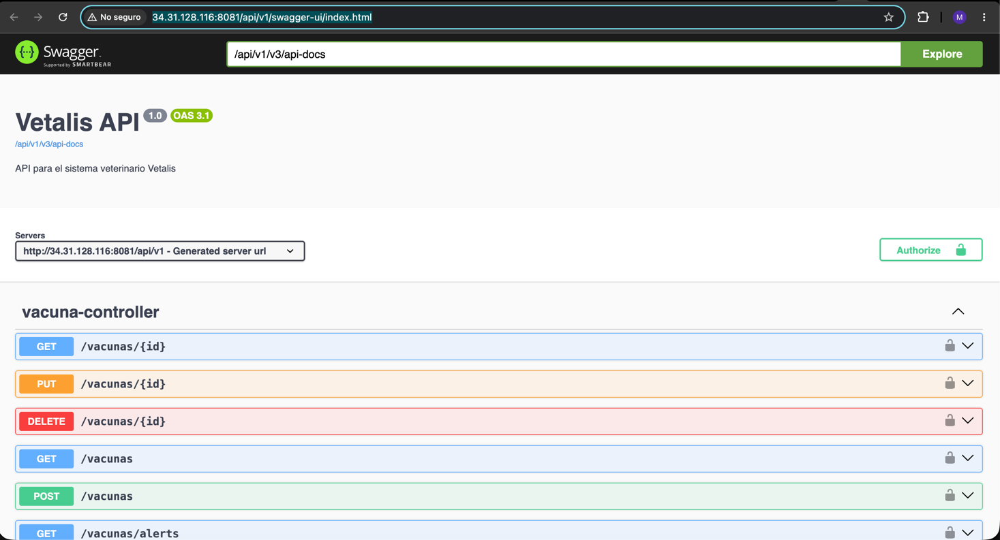

#### 5.2.3.6. Services Documentation Evidence for Sprint Review

En cumplimiento con los requerimientos, los Web Services han sido documentados utilizando OpenAPI Specification vía Swagger. La documentación detalla las acciones soportadas, los verbos HTTP, la sintaxis de llamada y los modelos de respuesta esperados.

**URL de Swagger UI:** http://34.31.128.116:8081/api/v1/swagger-ui/index.html

A continuación se presenta la evidencia de la documentación interactiva generada con Swagger/OpenAPI 3.1:

Se detallan los endpoints implementados y documentados durante este Sprint:

| Endpoint | Verbo HTTP | Descripción | Ejemplo de Llamada | Response |
| :--- | :---: | :--- | :--- | :---: |
| /vacunas | GET | Recupera la lista completa de vacunas registradas. | GET /api/v1/vacunas | 200 OK |
| /vacunas | POST | Registra una nueva vacuna en el sistema. | POST /api/v1/vacunas | 201 Created |
| /vacunas/{id} | GET | Obtiene los detalles de una vacuna específica por su ID. | GET /api/v1/vacunas/1 | 200 OK |
| /vacunas/{id} | PUT | Actualiza los datos de una vacuna existente. | PUT /api/v1/vacunas/1 | 200 OK |
| /vacunas/{id} | DELETE | Elimina una vacuna del registro. | DELETE /api/v1/vacunas/1 | 204 No Content |
| /vacunas/alerts | GET | Consulta las alertas de vacunación pendientes. | GET /api/v1/vacunas/alerts | 200 OK |

A continuación, se detalla el registro de los commits asociados a la generación de la documentación de los Web Services:

<table>
  <thead>
    <tr>
      <th>Repository</th>
      <th>Branch</th>
      <th>Commit ID</th>
      <th>Commit Message</th>
      <th>Commit Message Body</th>
      <th>Commited on (Date)</th>
    </tr>
  </thead>
  <tbody>
    <tr>
      <td rowspan="5" align="center" valign="middle">Vetalis- Backend</td>
      <td align="center">main</td>
      <td align="center">22b34f8</td>
      <td>feat: add boundend context clinical</td>
      <td>Bounded context clínico con endpoints documentados para gestión de historiales médicos.</td>
      <td align="center">19/06/2026</td>
    </tr>
    <tr>
      <td align="center">main</td>
      <td align="center">e2f49d1</td>
      <td>feat: add bounded context dashboard and iam</td>
      <td>Endpoints documentados para autenticación JWT e inicio de sesión en el módulo IAM.</td>
      <td align="center">19/06/2026</td>
    </tr>
    <tr>
      <td align="center">main</td>
      <td align="center">1dba316</td>
      <td>feat: add bounded context inventory</td>
      <td>Endpoints documentados del módulo de inventario incluyendo CRUD de vacunas y alertas.</td>
      <td align="center">19/06/2026</td>
    </tr>
    <tr>
      <td align="center">main</td>
      <td align="center">b53804c</td>
      <td>feat: add schedule and shared bounded contexts</td>
      <td>Endpoints documentados para la gestión de agenda y citas veterinarias.</td>
      <td align="center">19/06/2026</td>
    </tr>
    <tr>
      <td align="center">main</td>
      <td align="center">9ddcc9f</td>
      <td>feat: add boundend context iot</td>
      <td>Endpoints documentados para la gestión de dispositivos IoT de alimentación automática.</td>
      <td align="center">19/06/2026</td>
    </tr>
  </tbody>
</table>

#### 5.2.3.7. Software Deployment Evidence for Sprint Review

Se realizó la configuración y el despliegue exitoso de los Web Services en la nube, conectando el backend a una base de datos productiva. Esto asegura que la API esté disponible públicamente para el consumo de la Web Application (Frontend) previamente desplegada.

El backend fue desplegado en un servidor cloud con acceso público, permitiendo la interacción directa con los endpoints documentados a través de Swagger UI.

**URL de la API desplegada:** http://34.31.128.116:8081/api/v1/

**URL de Swagger UI:** http://34.31.128.116:8081/api/v1/swagger-ui/index.html

#### 5.2.3.8. Team Collaboration Insights during Sprint

La colaboración del equipo se mantuvo constante a través de GitHub, respetando la estrategia de ramas de GitFlow y el uso de Conventional Commits para asegurar la trazabilidad del desarrollo del backend.

A continuación se presentan los analíticos proporcionados por GitHub en su apartado de Insights, sobre la colaboración del equipo durante el Sprint 3:

**Contribuciones al desarrollo del Backend:**

---

## 5.3. Validation Interviews

### 5.3.1. Diseño de Entrevistas

**Segmento 1: Médico Veterinario**
1. Al iniciar sesión en la plataforma, ¿qué tan rápido e intuitivo le resultó el proceso de autenticación?
2. Al utilizar la barra de búsqueda de pacientes, ¿los resultados de la base de datos coincidieron con lo que esperaba encontrar?
3. Durante el registro de un triaje, ¿el sistema guardó su información de manera correcta y reflejó los datos actualizados?
4. Al revisar el historial clínico completo, ¿la información se cargó de forma clara y sin demoras significativas?
5. ¿Le resultó sencillo comprender y generar una receta médica digital desde la interfaz conectada?
6. ¿Considera que las alertas visuales de alergias son lo suficientemente claras para evitar errores de medicación?
7. En términos generales, ¿considera que el uso de esta plataforma en tiempo real agiliza su trabajo clínico diario en comparación con sus herramientas anteriores?

**Segmento 2: Administrador / Propietario de Veterinaria**
1. Al ingresar al sistema, ¿la carga inicial de los datos del Dashboard general le pareció fluida?
2. Al revisar la agenda de citas, ¿la información mostrada refleja con precisión las reservas registradas?
3. ¿Pudo identificar fácilmente los diferentes estados de las citas (pendientes, confirmadas) en el calendario?
4. ¿Experimentó algún tipo de lentitud o error al momento de navegar por los reportes financieros o de inventario?
5. ¿Qué tan claras le resultaron las alertas de stock mínimo de medicamentos proporcionadas por el sistema?
6. ¿Le fue sencillo interpretar los flujos de caja y reconciliación de pagos diarios mostrados en la interfaz?
7. ¿Esta vista centralizada le genera la confianza necesaria para tomar decisiones gerenciales rápidas y efectivas?

### 5.3.2. Registro de Entrevistas

**Segmento 1: Practicantes de veterinaria**

Entrevista N°1

● Nombre: Diego Fernando Lavado Quintanilla

● Sexo: Masculino

● Edad: 28

● Estado Civil: Soltero

● Labor: Practicante de Veterinaria

Detalles de la entrevista:

● Duración: 3:07

● URL: https://drive.google.com/file/d/1NFeYZikIhpmp7hBB6cVEut_OigyxbtEK/view?usp=sharing

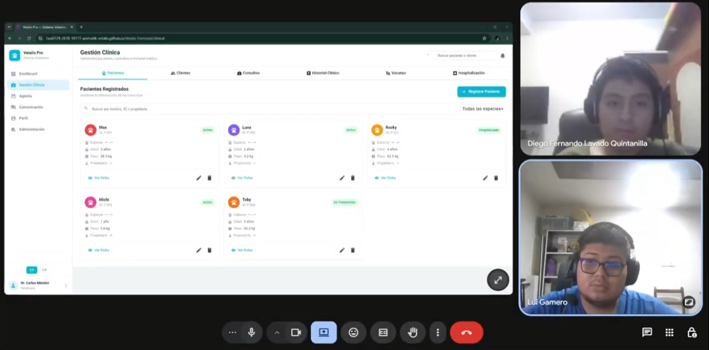 

Resumen de los puntos clave en la entrevista:

La entrevista evalúa la usabilidad y eficiencia de una plataforma de gestión clínica veterinaria. El entrevistado destaca que el sistema es rápido, intuitivo y eficiente en tiempo real, lo que reduce significativamente el trabajo manual y el tiempo perdido en papeleo entre consultas. Resalta la precisión en la búsqueda de pacientes, la correcta persistencia de datos al registrar un triaje y la carga estructurada y sin demoras del historial clínico. Como oportunidades de mejora, sugiere implementar un sistema de autocompletado más ágil al buscar medicamentos para las recetas digitales e intensificar el color rojo de las alertas visuales de alergias para captar la atención más rápidamente.

---

**Segmento 1: Practicantes de veterinaria**

Entrevista N°2

● Nombre: Ángel Matías Rocca

● Sexo: Masculino

● Edad: No especificada

● Estado Civil: No especificado

● Labor: Practicante de Veterinaria

Detalles de la entrevista:

● Duración: 3:08

● URL: https://drive.google.com/file/d/1M4I-Sl_nTlORD9gaPROh_wAGkTbjWP4G/view?usp=sharing

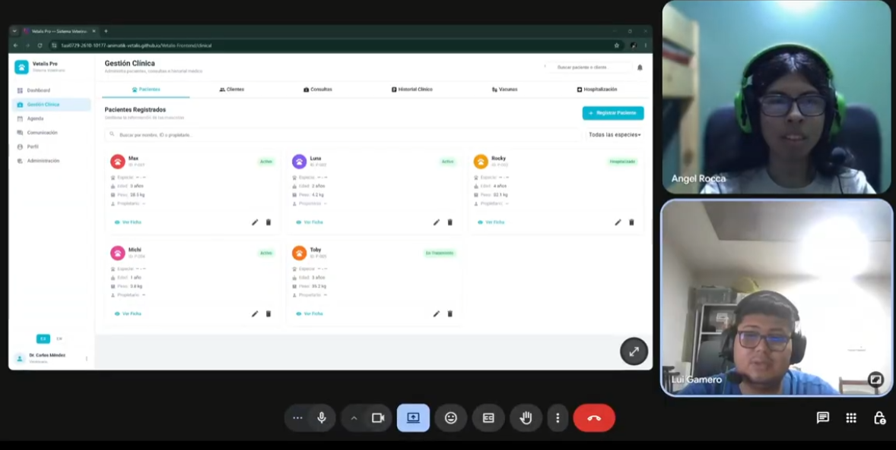 

Resumen de los puntos clave en la entrevista:

La entrevista evalúa el uso de una plataforma de gestión clínica veterinaria. El entrevistado resalta que el sistema es muy útil para reducir la carga mental y acelerar el flujo de atención diario. Destaca varios puntos fuertes: el proceso de inicio de sesión es sencillo y el uso de tokens mantiene la sesión activa sin necesidad de reingresar la contraseña constantemente; el buscador de pacientes filtra con exactitud incluso con nombres similares; y los datos de triaje se guardan de forma segura sin perderse al recargar la página. Además, menciona que el historial clínico es visualmente claro, ordenado y más rápido de consultar que las fichas físicas. También valora que la generación de recetas médicas esté conectada directamente con el inventario disponible y que las alertas visuales de alergias cumplen perfectamente su función preventiva en pacientes con condiciones críticas.

---

**Segmento 2: Administradores de centros veterinarios**

Entrevista N°3

● Nombre: Anghelo Faustino

● Sexo: Masculino

● Edad: 24

● Estado Civil: Soltero

● Labor: Administrador de Veterinaria

Detalles de la entrevista:

● Duración: 3:26

● URL: https://drive.google.com/file/d/1B6nk-ESuFE9yeQlp8TgnkcAIgUknUQ0r/view?usp=sharing

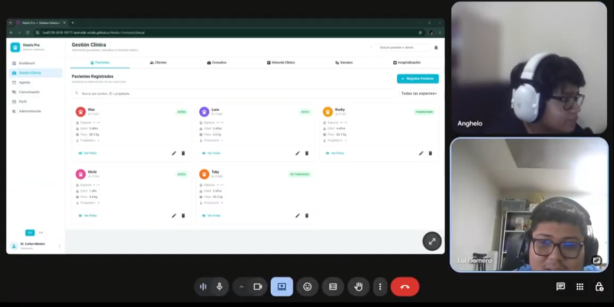 

Resumen de los puntos clave en la entrevista:

La entrevista se centra en la perspectiva administrativa de la plataforma de gestión clínica. El entrevistado, Anghelo, valora positivamente el sistema, destacando que el dashboard inicial presenta un resumen rápido de pacientes activos y atenciones del día. La agenda de citas en tiempo real es considerada vital para evitar cruces de horarios y permite identificar fácilmente los espacios libres de los practicantes. A nivel administrativo, destaca que no experimentó lentitud al navegar por los reportes financieros o de inventario, calificando al sistema de estable y robusto. Las alertas de stock mínimo son consideradas fundamentales, aunque sugiere la implementación de un correo automático en el futuro. Finalmente, resalta que el resumen financiero y la conciliación automática de pagos le otorgan la confianza necesaria para tomar decisiones gerenciales, ahorrándole horas de trabajo que antes invertía en cuadrar las cuentas a mano a fin de mes.

---

**Segmento 2: Administradores de centros veterinarios**

Entrevista N°4

● Nombre: Eduardo Aguirre

● Sexo: Masculino

● Edad: 26

● Estado Civil: Soltero

● Labor: Administrador de Veterinaria

Detalles de la entrevista:

● Duración: 04:33

● URL: https://drive.google.com/file/d/1arSjN2ninHc0QcYMgbDHZsIaBHZD0q9D/view?usp=sharing

 

Resumen de los puntos clave en la entrevista:

La entrevista evalúa la plataforma de gestión clínica desde la perspectiva de un administrador. Eduardo Aguirre destaca que el *dashboard* es muy fluido y carga toda la información de los pacientes automáticamente al iniciar sesión. Señala que la agenda de citas refleja con precisión los datos necesarios de las mascotas, como peso y edad, y permite identificar con claridad los espacios reservados o disponibles en el calendario. Además, afirma que la navegación por los reportes financieros y de inventario no presenta lentitud, resaltando una excelente velocidad de carga en las consultas. Considera que las alertas de stock mínimo son muy claras y visibles, lo cual es fundamental para anticipar compras a proveedores o emitir alertas de emergencia en caso de falta de inventario. Finalmente, menciona que la vista unificada de ingresos y flujos de caja es fácil de interpretar, lo que le brinda total confianza, exactitud y rapidez al momento de generar reportes y tomar decisiones gerenciales.

---

### 5.3.3. Evaluaciones según heurísticas

**Evaluación heurística de la aplicación Vetalis**

Este análisis se basa en los principios de usabilidad de Jakob Nielsen para evaluar la experiencia de usuario de la plataforma Vetalis, contrastando los hallazgos de las entrevistas de validación realizadas a ambos segmentos (Practicantes de veterinaria y Administradores de centros veterinarios). Se identifican fortalezas, debilidades y recomendaciones de mejora.

| Heurística | Severidad | Descripción | Recomendación |
| :--- | :--- | :--- | :--- |
| Visibilidad del estado del sistema | 1 | El Dashboard inicial presenta de forma inmediata un resumen de pacientes activos, atenciones del día y carga automáticamente la información al iniciar sesión, lo cual fue valorado positivamente por ambos administradores entrevistados. | Mantener el comportamiento actual. Se podría añadir un indicador visual de "última actualización" para reforzar la confianza en la data mostrada. |
| Coincidencia entre el sistema y el mundo real | 1 | El buscador de pacientes filtra con exactitud incluso ante nombres similares, y el historial clínico se muestra de forma clara y ordenada, replicando la lógica con la que el personal médico revisaba antes las fichas físicas. | Conservar el diseño actual. Se sugiere mantener la nomenclatura clínica estándar al incorporar nuevos módulos. |
| Control y libertad del usuario | 2 | Los datos de triaje se guardan de forma segura sin perderse al recargar la página; sin embargo, no se reportó explícitamente una opción visible de deshacer o cancelar un registro clínico en proceso. | Incorporar un botón de "Cancelar/Deshacer" explícito durante el registro de triaje y recetas, evitando que el usuario dependa únicamente del autoguardado. |
| Consistencia y estándares | 1 | La agenda de citas refleja con precisión los datos necesarios de las mascotas (peso, edad) y permite identificar con claridad los espacios reservados o disponibles, manteniendo un mismo patrón visual entre los módulos de citas, inventario y reportes financieros. | Mantener el estándar visual actual entre módulos. Documentar la guía de estilo para que futuros componentes (IoT) respeten la misma consistencia. |
| Prevención de errores | 2 | Las alertas visuales de alergias cumplen su función preventiva en pacientes con condiciones críticas; no obstante, un entrevistado sugirió intensificar el color rojo de dichas alertas para captar la atención de forma más inmediata durante la consulta. | Aumentar el contraste y saturación del color de alerta de alergias, y evaluar la incorporación de un ícono de advertencia adicional junto al texto. |
| Reconocimiento antes que recordar | 2 | La generación de recetas médicas está conectada directamente con el inventario disponible, lo cual reduce la carga de memoria del veterinario; sin embargo, se identificó que el autocompletado al buscar medicamentos podría ser más ágil. | Optimizar el algoritmo de autocompletado de medicamentos para reducir la cantidad de caracteres necesarios antes de sugerir resultados relevantes. |
| Flexibilidad y eficiencia de uso | 1 | El uso de tokens de sesión permite a los practicantes mantenerse autenticados sin reingresar la contraseña constantemente, agilizando el flujo de atención diario tanto para usuarios nuevos como recurrentes. | Mantener el manejo de sesión actual. Se podría añadir accesos rápidos (shortcuts) para usuarios administradores frecuentes en los reportes financieros. |
| Diseño estético y minimalista | 1 | El sistema fue calificado como estable, robusto y fluido al navegar por reportes financieros e inventario, sin sobrecarga de información ni lentitud reportada por ninguno de los cuatro entrevistados. | Mantener el estilo actual. Se podría reforzar con micro-animaciones sutiles al cargar los dashboards para mejorar la percepción de fluidez. |
| Ayudar a los usuarios a reconocer y recuperarse de errores | 2 | No se reportaron errores críticos durante las pruebas; sin embargo, no se evidenció un mensaje claro de recuperación ante posibles fallos de conexión con los dispensadores IoT durante la dispensación automática de alimento. | Diseñar mensajes de error específicos para fallos de conectividad IoT, indicando al usuario la causa probable y los pasos a seguir. |
| Ayuda y documentación | 3 | Las alertas de stock mínimo de medicamentos son consideradas claras y fundamentales para anticipar compras a proveedores; no obstante, un administrador sugirió implementar una notificación automática por correo electrónico como refuerzo. | Implementar un sistema de notificaciones automáticas vía correo electrónico o push, complementando las alertas visuales dentro de la plataforma. |

## 5.4. Video About-the-Product

El Video About-the-Product tiene una orientación promocional enfocada a visitantes del Landing Page y a posibles clientes de la clínica. Resume el modelo de negocio, destacando cómo se centralizan las historias clínicas (EHR), se agiliza la gestión administrativa (ERP) y se automatiza el cuidado de los pacientes. El contenido incluye demostraciones de uso del software funcional y recoge el valor agregado que la solución aporta al rubro veterinario.

---
## Conclusiones

---

### Conclusiones y recomendaciones

**Conclusiones:**
1. **Adopción exitosa de Metodologías Ágiles:** El uso de Sprints y herramientas como Trello y Pivotal Tracker ha permitido al equipo de Animatik mantener un flujo de trabajo organizado y estructurado. Esto se evidenció en la entrega oportuna de la Landing Page en el Sprint 1 y del Frontend de la aplicación web en el Sprint 2, cumpliendo con los objetivos y la velocidad estimada.
2. **Eficiencia en la Gestión de Configuración y Control de Versiones:** La estricta implementación de GitFlow en GitHub, apoyada con Convenciones de Commits (Conventional Commits), facilitó la colaboración fluida entre los desarrolladores, mitigando conflictos de integración y asegurando la estabilidad de las ramas `main` y `develop`.
3. **Calidad y Estandarización de Código:** La definición y seguimiento de guías de estilo para HTML, CSS, TypeScript y Angular ha garantizado que el código base de Vetalis sea escalable, legible y fácilmente mantenible.
4. **Despliegue Continuo con Github Pages:** La automatización básica implementada a través de GitHub Pages ha demostrado ser una solución efectiva y ágil para el despliegue tanto de la Landing Page como del Frontend, permitiendo la validación continua del producto por parte de los stakeholders.
5. **Enfoque Centrado en el Usuario (Veterinarios):** La correcta maquetación de funcionalidades clave, como el Electronic Health Record (EHR), el registro de signos vitales (Triaje) y el módulo de recetas médicas, demuestra que la solución Vetalis está profundamente alineada con las necesidades operativas de la gestión clínica veterinaria y el control de dispositivos IoT.

**Recomendaciones:**
1. **Mejora en la Estimación de Tareas:** Se recomienda refinar la asignación de Story Points y la estimación de tiempos, especialmente para módulos con alta complejidad en diseño responsivo y lógica de componentes, evitando la sobrecarga técnica al final de cada Sprint.
2. **Integración Continua Avanzada:** A medida que el proyecto escale hacia el desarrollo del Backend (Spring Boot/Java) y los servicios IoT, será recomendable implementar pipelines o flujos de CI/CD (GitHub Actions) más robustos que incluyan pruebas automatizadas antes del despliegue.
3. **Validación Temprana con Usuarios Finales:** Se sugiere ejecutar rondas de Usability Testing con veterinarios y administradores utilizando el Frontend actual, para aplicar ajustes de experiencia de usuario (UX) antes de completar la integración con la base de datos y la API.

### Video About-the-Team

---

## Bibliografía

Beyer, K., Chomiak-Orsa, I., Pietrzykowski, Z., & Rozkrut, D. (2025). *Digital transformation and business process improvement in veterinary clinics*. (pp. 201-213). https://doi.org/10.18276/978-83-8419-028-9-15

Mallikarjun, A., Charendoff, I., Moore, M. B., Wilson, C., Nguyen, E., Hendrzak, A. J., Poulson, J., Gibison, M., & Otto, C. M. (2024). Assessing Different Chronic Wasting Disease Training Aids for Use with Detection Dogs. *Animals*, *14*(2), 300. https://doi.org/10.3390/ani14020300

Soltani, Z., & Siadati, S. (2019). *The impact of business intelligence on increasing the efficiency and health quality of surgical centers*. (Research on Health Management and Efficiency).

---

